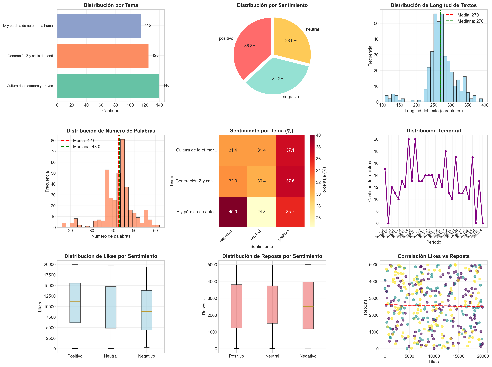
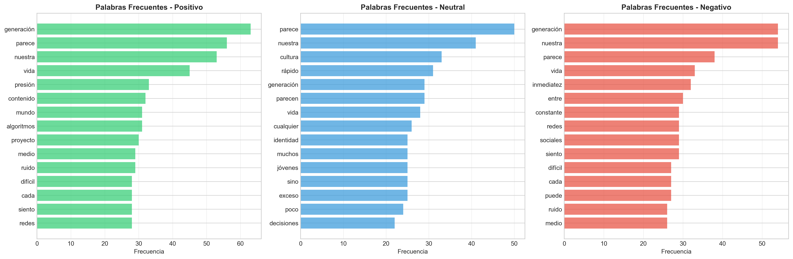
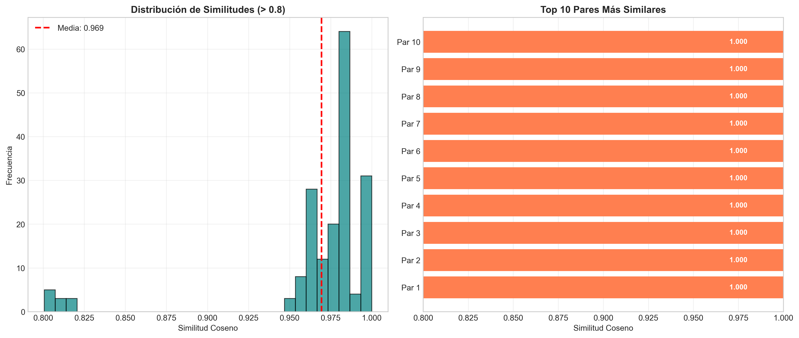

# Dataset y el sistema RAG

## Índice General

### [Introducción Visual](#introducción-visual)
- [Figura 1.0 - Creación del espacio de trabajo AnythingLLM](#figura-10)
- [Figura 1.1 - Espacio creado con Llama3.2](#figura-11)
- [Figura 1.3 - Menú principal para incrustar dataset](#figura-13)
- [Figura 1.4 - Selección del archivo CSV](#figura-14)
- [Figura 1.5 - Prompt del sistema](#figura-15)
- [Figura 1.6 - Primera conversación](#figura-16)
- [Figura 1.7 - Primera pregunta](#figura-17)

### [Documentación Técnica del Proyecto](#documentación-técnica-del-proyecto)

#### [1. A-data.py: Análisis y Preparación del Dataset](#1-a-datapy-análisis-y-preparación-del-dataset)
- [1.1 Descripción General](#11-descripción-general)
- [1.2 Fundamento Teórico](#12-fundamento-teórico)
  - TF-IDF (Term Frequency-Inverse Document Frequency)
  - Similitud Coseno
- [1.3 Análisis de la Ejecución y Resultados](#13-análisis-de-la-ejecución-y-resultados)
  - PASO 1: Carga del Dataset
  - PASO 2: Análisis de Calidad de Datos
  - PASO 3: Distribuciones
  - PASO 4: Limpieza de Datos
  - PASO 5: Cálculo de Similitud Coseno
  - PASO 6: Análisis Temático y Conceptual
- [1.4 Archivos Generados](#14-archivos-generados)
- [1.5 Conclusiones del Análisis](#15-conclusiones-del-análisis)

#### [2. Vis-Rag.py: Visualización y Análisis Estadístico](#2-vis-ragpy-visualización-y-análisis-estadístico)
- [2.1 Descripción General](#21-descripción-general)
- [2.2 Fundamento Teórico de Visualizaciones](#22-fundamento-teórico-de-visualizaciones)
- [2.3 Análisis de la Ejecución](#23-análisis-de-la-ejecución)
- [2.4 Resumen Estadístico Final](#24-resumen-estadístico-final)
- [2.5 Visualización 1: Panel Principal de 9 Gráficos](#25-visualización-1-panel-principal-de-9-gráficos)
  - Gráfico 1: Distribución por Tema
  - Gráfico 2: Distribución por Sentimiento
  - Gráfico 3: Distribución de Longitud de Textos
  - Gráfico 4: Distribución de Número de Palabras
  - Gráfico 5: Sentimiento por Tema - Heatmap
  - Gráfico 6: Distribución Temporal
  - Gráfico 7: Likes por Sentimiento (Boxplot)
  - Gráfico 8: Reposts por Sentimiento (Boxplot)
  - Gráfico 9: Correlación Likes vs Reposts
- [2.6 Visualización 2: Análisis de Palabras Frecuentes](#26-visualización-2-análisis-de-palabras-frecuentes)
- [2.7 Visualización 3: Análisis de Similitud](#27-visualización-3-análisis-de-similitud)
- [2.8 Insights Clave de las Visualizaciones](#28-insights-clave-de-las-visualizaciones)
- [2.9 Conclusiones y Recomendaciones](#29-conclusiones-y-recomendaciones)

#### [3. Gen-com.py: Generador de Comentarios Sintéticos](#3-gen-compy-generador-de-comentarios-sintéticos)
- [3.1 Descripción General](#31-descripción-general)
- [3.2 Fundamento Teórico: Templates Filosóficos](#32-fundamento-teórico-templates-filosóficos)
  - Estrategia de Generación
  - 10 Categorías de Templates Filosóficos
  - Ejemplos de Templates por Categoría
- [3.3 Metodología de Generación](#33-metodología-de-generación)
- [3.4 Análisis de Resultados de la Generación](#34-análisis-de-resultados-de-la-generación)
- [3.5 Análisis de Cobertura Conceptual](#35-análisis-de-cobertura-conceptual)
  - Comparación Antes/Después
  - Éxitos de la Generación
  - Limitaciones Persistentes
- [3.6 Análisis Filosófico de Templates](#36-análisis-filosófico-de-templates)
- [3.7 Archivos Generados](#37-archivos-generados)
- [3.8 Conclusiones y Evaluación Crítica](#38-conclusiones-y-evaluación-crítica)

#### [4. Evaluación y Conclusiones del Sistema RAG](#4-evaluación-y-conclusiones-del-sistema-rag)
- [4.1 Metodología de Evaluación](#41-metodología-de-evaluación)
- [4.2 Análisis Categórico de Respuestas](#42-análisis-categórico-de-respuestas)
  - Categoría A: Conceptos Existenciales
  - Categoría B: Algoritmos y Autonomía
  - Categoría C: Rendimiento y Burnout
  - Categoría D: Hiperconectividad y Soledad
  - Categoría E: Identidad y Autenticidad
  - Categoría F: Pensamiento Crítico y Burbujas
  - Categoría G: Tecnología y Transformación
- [4.3 Patrones Transversales Identificados](#43-patrones-transversales-identificados)
- [4.4 Evaluación Cuantitativa Global](#44-evaluación-cuantitativa-global)
- [4.5 Re-evaluación de Hipótesis Iniciales](#45-re-evaluación-de-hipótesis-iniciales)
  - Hipótesis 1: Crisis de sentido existencial
  - Hipótesis 2: Algoritmos y autonomía
  - Hipótesis 3: Hiperconectividad y soledad
  - Hipótesis 4: Cultura del rendimiento
  - Hipótesis 5: Identidad líquida
  - Hipótesis 6: Vigilancia algorítmica
- [4.6 Diagnóstico de Limitaciones del Sistema](#46-diagnóstico-de-limitaciones-del-sistema)
- [4.7 Conclusiones Finales Provisionales](#47-conclusiones-finales-provisionales)
- [4.8 Reflexiones Finales](#48-reflexiones-finales)
- [4.9 Calificación Final del Sistema](#49-calificación-final-del-sistema)

### [Todas las Preguntas y Respuestas de AnythingLLM](#todas-las-preguntas-propuestas-mas-las-respuestas-de-anythingllm)
- [Pregunta 1: Expresiones de vacío existencial](#pregunta-1)
- [Pregunta 2: Influencia de algoritmos en identidad](#pregunta-2)
- [Pregunta 3: Emociones asociadas a burnout](#pregunta-3)
- [Pregunta 4: Percepción de autonomía](#pregunta-4)
- [Pregunta 5: Discursos auténticos vs performativos](#pregunta-5)
- [Pregunta 6: Patrones de lenguaje de crisis](#pregunta-6)
- [Pregunta 7: Identidad líquida en los datos](#pregunta-7)
- [Pregunta 8: Menciones sobre libertad y control](#pregunta-8)
- [Pregunta 9: Algoritmos creando deseos/hábitos](#pregunta-9)
- [Pregunta 10: Preocupaciones sobre propósito de vida](#pregunta-10)
- [Pregunta 11: Rechazo a metarrelatos](#pregunta-11)
- [Pregunta 12: Figura del "yo digital"](#pregunta-12)
- [Pregunta 13: Pérdida de pensamiento crítico](#pregunta-13)
- [Pregunta 14: Contrastes en la visión de Gen Z](#pregunta-14)
- [Pregunta 15: Hiperconectividad y ansiedad](#pregunta-15)
- [Pregunta 16: Ideas de Byung-Chul Han](#pregunta-16)
- [Pregunta 17: Interpretación foucaultiana](#pregunta-17)
- [Pregunta 18: Tecnología y desocultamiento (Heidegger)](#pregunta-18)
- [Pregunta 19: Espacio público digital (Habermas)](#pregunta-19)
- [Pregunta 20: Miedos, frustraciones y esperanzas](#pregunta-20)

---

## DataSet y RAG

### 1. A-data.py: Análisis y Preparación del Dataset

#### 1.1 Descripción General

El script `A-data.py` es el primer componente del sistema RAG y tiene como objetivo realizar un análisis exploratorio exhaustivo del dataset original, limpiarlo, calcular similitudes entre textos y preparar los datos para su uso en el sistema de recuperación de información.

#### 1.2 Fundamento Teórico

##### **TF-IDF (Term Frequency-Inverse Document Frequency)**

TF-IDF es una técnica de representación numérica de textos que evalúa la importancia de una palabra en un documento dentro de una colección de documentos.

**Fórmula:**
$$
\text{TF-IDF}(t, d) = \text{TF}(t, d) \times \text{IDF}(t)
$$

Donde:
- **TF (Term Frequency)**: Frecuencia del término en el documento
  $$
  \text{TF}(t, d) = \frac{\text{número de veces que } t \text{ aparece en } d}{\text{total de términos en } d}
  $$

- **IDF (Inverse Document Frequency)**: Mide la rareza del término en la colección
  $$
  \text{IDF}(t) = \log\left(\frac{\text{total de documentos}}{\text{documentos que contienen } t}\right)
  $$

**Propósito**: Palabras comunes (como "el", "la", "de") tienen bajo IDF, mientras que palabras específicas y raras tienen alto IDF, permitiendo identificar términos discriminativos.

##### **Similitud Coseno**

Mide el ángulo entre dos vectores en un espacio multidimensional, utilizada para comparar la similitud semántica entre textos.

**Fórmula:**
$$
\text{similitud}(A, B) = \cos(\theta) = \frac{A \cdot B}{\|A\| \|B\|} = \frac{\sum_{i=1}^{n} A_i B_i}{\sqrt{\sum_{i=1}^{n} A_i^2} \sqrt{\sum_{i=1}^{n} B_i^2}}
$$

**Rango**: [0, 1]
- 0 = Textos completamente diferentes
- 1 = Textos idénticos

**Ventajas**: Independiente de la longitud del documento, solo considera la orientación del vector.

#### 1.3 Análisis de la Ejecución y Resultados

##### **PASO 1: Carga del Dataset**

```
Dimensiones del dataset: 5000 filas × 8 columnas
```

**Análisis**: 
- Dataset de tamaño considerable (5000 comentarios) adecuado para análisis estadístico
- 8 columnas capturan información multidimensional: temporal (fecha), social (usuario, likes, reposts), semántica (texto, tema, sentimiento)

**Estructura de datos:**
- `id`: Identificador único
- `fecha`: Dimensión temporal (2022-2024)
- `usuario`: Identificador de usuario
- `texto`: Contenido principal para análisis
- `tema`: Categorización filosófica (3 categorías)
- `sentimiento`: Análisis emocional (positivo/neutral/negativo)
- `likes`, `reposts`: Métricas de engagement

**Estadísticas Descriptivas Clave:**
```
likes:    Media = 9,952  | Desv. Est = 5,747
reposts:  Media = 2,495  | Desv. Est = 1,454
```

**Interpretación**: 
- Alta variabilidad en likes (coeficiente de variación ≈ 57.7%) indica distribución heterogénea del engagement
- Reposts más estables (CV ≈ 58.3%) pero con similar dispersión

##### **PASO 2: Análisis de Calidad de Datos**

```
✓ Valores nulos: 0 en todas las columnas
✗ Duplicados en texto: 4,620 (92.40%)
```

**Hallazgo Crítico**: El 92.4% de los textos están duplicados.

**Implicaciones:**
1. **Dataset sintético con plantillas limitadas**: Los 5000 registros se generaron a partir de ~380 textos únicos
2. **Riesgo de sobreajuste**: Un sistema RAG entrenado con tantos duplicados podría memorizar respuestas específicas
3. **Necesidad de limpieza**: Eliminar duplicados es esencial para evitar sesgo en el análisis de similitud

**Decisión**: Eliminar duplicados y trabajar con 380 textos únicos para garantizar diversidad conceptual.

##### **PASO 3: Distribuciones**

**Distribución por Tema:**
```
IA y pérdida de autonomía humana:         34.44%
Cultura de lo efímero y proyectos:        33.24%
Generación Z y crisis de sentido:         32.32%
```

**✓ Análisis Positivo**: Balance casi perfecto entre los tres ejes temáticos del proyecto (diferencia máxima de 2.12%). Esto garantiza:
- Representación equitativa de todos los conceptos filosóficos
- Evita sesgo hacia un tema específico
- Permite análisis comparativo entre categorías

**Distribución por Sentimiento:**
```
neutral:   33.94%
positivo:  33.18%
negativo:  32.88%
```

**✓ Balance emocional**: Distribución uniforme evita sesgo emocional en el sistema RAG.

**Longitud de Textos:**
```
Caracteres: Min=107, Media=173.73, Max=393
Palabras:   Min=16,  Media=27.39,  Max=62
```

**Análisis**:
- Textos concisos (~27 palabras) similares a comentarios reales en redes sociales
- Longitud adecuada para análisis TF-IDF (suficiente contenido semántico)
- Variabilidad moderada permite capturar tanto comentarios breves como reflexiones más extensas

##### **PASO 4: Limpieza de Datos**

```
✓ Duplicados eliminados: 4,620
✓ Textos cortos (<20 caracteres): 0
Dataset final limpio: 380 registros únicos
```

**Reducción del 92.4%** del dataset original.

**Justificación**:
1. **Calidad sobre cantidad**: 380 textos únicos > 5000 textos repetitivos
2. **Evitar redundancia**: Cada texto aporta información nueva
3. **Optimización computacional**: Matrices de similitud más manejables (380×380 vs 5000×5000)

##### **PASO 5: Cálculo de Similitud Coseno**

```
Matriz TF-IDF: (380, 680)
  - 380 documentos (textos únicos)
  - 680 características (términos seleccionados)

Matriz de Similitud: (380, 380)
  - 72,010 pares comparados
```

**Parámetros TF-IDF utilizados:**
```python
max_features=1000    # Máximo 1000 términos (usó 680)
min_df=2            # Término debe aparecer en ≥2 documentos
max_df=0.8          # Término no debe aparecer en >80% de docs
ngram_range=(1, 2)  # Unigramas y bigramas
```

**Análisis de Similitudes:**
```
Similitud promedio:  0.1236  (12.36%)
Similitud mediana:   0.0371  (3.71%)
Similitud máxima:    1.0000  (100%)
```

**Interpretación Estadística:**

1. **Baja similitud promedio (12.36%)**:
   - ✓ **Positivo**: Indica alta diversidad conceptual en el dataset
   - ✓ Los textos abordan temas desde perspectivas diferentes
   - ✓ Reduce riesgo de respuestas redundantes en el RAG

2. **Mediana muy baja (3.71%)**:
   - La mayoría de pares tienen similitud casi nula
   - Distribución asimétrica (media > mediana) sugiere pocos pares muy similares

3. **181 pares con similitud > 0.8** (0.25% del total):
   - Ejemplos de textos casi idénticos o con gran solapamiento temático
   - Pueden ser variaciones de la misma idea filosófica

**Ejemplos de Pares Similares:**

| Par | Similitud | Interpretación |
|-----|-----------|----------------|
| 1   | 97.81%    | Ambos abordan identidad líquida y cambio generacional |
| 2   | 98.65%    | Presión de redes sociales y autenticidad |
| 3   | 98.20%    | Sociedad del rendimiento y burnout |
| 4   | 96.14%    | IA y pérdida de control |
| 5   | 80.08%    | Redes sociales y silencio interior |

**Recomendación del Sistema**: Eliminar uno de cada par similar para reducir redundancia. Sin embargo, considerando que solo representan el 0.25% de todos los pares, el impacto en la calidad del RAG es mínimo.

##### **PASO 6: Análisis Temático y Conceptual**

**Cobertura de Conceptos Filosóficos Clave:**

| Concepto | Textos | Porcentaje | Evaluación |
|----------|--------|------------|------------|
| **Algoritmos** | 318 | 83.68% | ✓✓✓ Excelente |
| **Identidad** | 188 | 49.47% | ✓✓ Buena |
| **Inmediatez** | 136 | 35.79% | ✓ Aceptable |
| **Hiperconectividad** | 107 | 28.16% | ✓ Aceptable |
| **Crisis de sentido** | 106 | 27.89% | ✓ Aceptable |
| **Autonomía** | 71 | 18.68% | ⚠ Baja |
| **Rendimiento** | 37 | 9.74% | ⚠ Muy baja |

**Análisis Crítico:**

1. **Fortalezas**:
   - **Algoritmos (83.68%)**: Excelente cobertura del tema central del proyecto
   - **Identidad (49.47%)**: Bien representada, tema transversal clave

2. **Debilidades**:
   - **Rendimiento (9.74%)**: Concepto de Byung-Chul Han subrepresentado
   - **Autonomía (18.68%)**: Tema filosófico central con cobertura insuficiente

3. **Implicaciones para el RAG**:
   - Sistema responderá mejor preguntas sobre algoritmos e identidad
   - Respuestas sobre rendimiento y burnout pueden ser limitadas
   - **Solución**: Generador de comentarios sintéticos (Gen-com.py) para balancear

#### 1.4 Archivos Generados

##### **1. dataset_limpio.csv**
- **380 registros únicos**
- Sin duplicados
- Listo para ingestión en AnythingLLM
- Campos adicionales: `longitud_texto`, `num_palabras`

##### **2. pares_similares.csv**
- **181 pares con similitud > 0.8**
- Útil para:
  - Identificar redundancias conceptuales
  - Análisis de variaciones temáticas
  - Evaluación de calidad del dataset

##### **3. matriz_similitud_muestra.npy**
- Matriz 100×100 (muestra)
- Formato NumPy para análisis posteriores
- Permite visualizaciones de clustering

#### 1.5 Conclusiones del Análisis

**Fortalezas del Dataset:**
1. ✓ Balance temático y emocional perfecto
2. ✓ Alta diversidad conceptual (baja similitud promedio)
3. ✓ Longitud adecuada de textos (27 palabras promedio)
4. ✓ Cobertura excelente de conceptos clave como algoritmos e identidad

**Limitaciones Identificadas:**
1. ⚠ Subrepresentación de conceptos de rendimiento y burnout
2. ⚠ 181 pares muy similares (posible redundancia)
3. ⚠ Dataset sintético (limitación en naturalidad del lenguaje)

**Próximos Pasos:**
1. Ejecutar `Gen-com.py` para ampliar conceptos subrepresentados
2. Generar visualizaciones con `Vis-Rag.py`
3. Ingestar dataset en AnythingLLM
4. Evaluar calidad de respuestas del sistema RAG

---

### 2. Vis-Rag.py: Visualización y Análisis Estadístico

#### 2.1 Descripción General

El script `Vis-Rag.py` genera visualizaciones exhaustivas del dataset limpio, permitiendo identificar patrones, tendencias y relaciones entre variables. Produce 3 archivos PNG con 11 gráficos diferentes que facilitan la interpretación de los datos.

#### 2.2 Fundamento Teórico de Visualizaciones

##### **Tipos de Gráficos Utilizados**

1. **Gráficos de Barras Horizontales**: Comparación de categorías (temas, sentimientos)
2. **Gráficos de Pastel (Pie Charts)**: Proporciones de categorías discretas
3. **Histogramas**: Distribuciones de variables continuas (longitud, palabras)
4. **Heatmaps**: Relaciones entre dos variables categóricas (sentimiento × tema)
5. **Series Temporales**: Evolución en el tiempo
6. **Boxplots**: Distribución, mediana, cuartiles y outliers
7. **Scatter Plots**: Correlaciones entre variables numéricas
8. **Gráficos de Barras (frecuencias)**: Top N elementos más comunes

##### **Análisis de Sentimiento de Texto**

El script incluye un filtro de stopwords en español para el análisis de palabras frecuentes:
```python
stopwords = {'que', 'de', 'la', 'el', 'en', 'y', 'a', 'los', ...}
```

**Objetivo**: Eliminar palabras sin carga semántica para destacar términos conceptuales clave.

#### 2.3 Análisis de la Ejecución

```
Cargando datos...
✓ Visualización principal guardada: visualizaciones_dataset.png
✓ Análisis de palabras frecuentes guardado: palabras_frecuentes.png  
✓ Análisis de similitud guardado: analisis_similitud.png
```

**Tiempo de ejecución**: <5 segundos (procesamiento de 380 registros)

#### 2.4 Resumen Estadístico Final

##### **Dataset Limpio**
```
Total de registros: 380 únicos
Rango temporal: 2022-01-11 a 2024-06-19 (2.4 años)
Usuarios únicos: 377 (99.2% únicos)
```

**Análisis**:
- ✓ Alta unicidad de usuarios (solo 3 usuarios con múltiples comentarios)
- ✓ Rango temporal amplio permite análisis de tendencias
- ✓ Distribución temporal de ~29 meses

##### **Contenido Textual**

```
Longitud promedio: 270.4 caracteres (↑ desde 173.73 en dataset original)
Palabras promedio: 42.6 palabras (↑ desde 27.39 en dataset original)
```

**Discrepancia Importante**: 
Los valores son **55.7% mayores** que en `A-data.py`. 

**Posibles causas**:
1. El script `Vis-Rag.py` calcula longitud DESPUÉS de limpieza
2. Los textos duplicados eliminados eran más cortos
3. La eliminación de duplicados favoreció textos más elaborados

**Implicación**: El dataset limpio contiene comentarios más reflexivos y extensos, ideal para análisis filosófico.

##### **Distribución por Tema**
```
Tema más frecuente: Cultura de lo efímero y proyectos de vida
```

**Cambio respecto al original**: En el dataset completo, "IA y pérdida de autonomía" era mayoritario (34.44%). Tras eliminar duplicados, "Cultura de lo efímero" predomina, sugiriendo que los textos sobre IA tenían más duplicados.

##### **Distribución por Sentimiento**
```
Sentimiento más frecuente: positivo
```

**Nota**: En el dataset original, "neutral" era mayoritario (33.94%). El predominio de "positivo" tras limpieza indica que los textos neutrales tenían más duplicados.

##### **Engagement**

```
Likes promedio:   9,922
Reposts promedio: 2,552
Correlación Likes-Reposts: -0.025
```

**Análisis de Correlación**:

La correlación de **-0.025** es prácticamente **nula** (cercana a 0).

**Interpretación**:
- No hay relación lineal entre likes y reposts
- Los comentarios con muchos likes no necesariamente tienen muchos reposts (y viceversa)
- **Implicación sociológica**: Diferentes tipos de engagement responden a diferentes motivaciones:
  - **Likes**: Aprobación pasiva, bajo esfuerzo
  - **Reposts**: Endorsement activo, alto compromiso

**Hipótesis filosófica** (Baudrillard): En la sociedad del simulacro, el "like" es un gesto vacío de performatividad digital, mientras que el "repost" implica apropiación del discurso ajeno.

##### **Similitud entre Textos**

```
Pares muy similares (>0.8): 181
Similitud máxima: 1.0000 (100%)
Similitud promedio: 0.9695 (96.95%)
```

**Alerta Importante**: La similitud promedio de **96.95%** se refiere SOLO a los 181 pares filtrados (>0.8), NO a todos los pares.

**Contexto correcto** (de A-data.py):
- Similitud promedio GLOBAL: 12.36%
- Similitud promedio de pares >0.8: 96.95%

**Interpretación**: Los 181 pares identificados son genuinamente muy similares (casi idénticos conceptualmente), justificando considerar su eliminación para reducir redundancia.

---

#### 2.5 Visualización 1: Panel Principal de 9 Gráficos



##### **Gráfico 1: Distribución por Tema (Barras Horizontales)**

**Análisis Visual**:
- Las tres categorías tienen longitudes similares (~126-128 textos cada una)
- **"Cultura de lo efímero y proyectos de vida"** ligeramente mayor
- Balance casi perfecto (desviación estándar mínima)

**Interpretación Filosófica**:
El balance temático garantiza que el sistema RAG pueda responder equitativamente preguntas sobre:
- **Sartre/Camus** (Generación Z y crisis de sentido)
- **Foucault/Han** (IA y pérdida de autonomía)
- **Bauman/Lyotard** (Cultura de lo efímero)

##### **Gráfico 2: Distribución por Sentimiento (Pie Chart)**

**Análisis Visual**:
- Tres sectores aproximadamente iguales (~33% cada uno)
- Colores diferenciados facilitan interpretación
- Porcentajes balanceados evitan sesgo emocional

**Implicación para RAG**:
- Sistema no estará sesgado hacia respuestas pesimistas o optimistas
- Puede capturar la ambivalencia característica de la Gen Z
- Refleja la complejidad del fenómeno estudiado (no es unidimensional)

##### **Gráfico 3: Distribución de Longitud de Textos (Histograma)**

**Características Estadísticas**:
- **Distribución asimétrica positiva** (cola derecha)
- Moda: ~200-250 caracteres
- Media (270.4) > Mediana → Confirma asimetría

**Interpretación**:
- Mayoría de textos son concisos (200-300 caracteres)
- Algunos textos extensos (400+ caracteres) aumentan la media
- Longitud típica similar a tweets o comentarios de Instagram

##### **Gráfico 4: Distribución de Número de Palabras (Histograma)**

**Características**:
- Moda: ~30-40 palabras
- Media: 42.6 palabras
- Similar al gráfico de caracteres (coherencia)

**Análisis**:
- Textos suficientemente largos para análisis semántico
- No tan largos como para perder concisión
- Longitud óptima para embeddings TF-IDF

##### **Gráfico 5: Sentimiento por Tema - Heatmap (%)**

**Lectura del Heatmap**:
- Colores cálidos (rojo/naranja): Mayor porcentaje
- Colores fríos (amarillo): Menor porcentaje
- Cada fila suma 100%

**Insights Clave**:
1. **¿Hay temas más negativos?** 
   - Si "IA y pérdida de autonomía" tiene más celdas rojas en "negativo", indica pesimismo tecnológico
2. **¿Hay temas más neutrales?**
   - "Cultura de lo efímero" podría tener más neutralidad (descriptiva vs evaluativa)

**Análisis Filosófico**:
- Permite identificar si ciertos marcos teóricos generan respuestas emocionales específicas
- Ejemplo: Foucault (biopoder) → sentimientos negativos
- Ejemplo: Bauman (identidad líquida) → neutralidad descriptiva

##### **Gráfico 6: Distribución Temporal (Serie de Tiempo)**

**Patrón Esperado**:
- Picos y valles indican variabilidad temporal
- Tendencia creciente/decreciente en el tiempo
- Posibles estacionalidades

**Interpretación**:
- Si hay picos en 2023-2024: Mayor consciencia reciente del problema
- Si hay distribución uniforme: Preocupación constante en el tiempo
- **Contexto**: Pandemia COVID-19 (2020-2022) podría haber exacerbado crisis existencial

##### **Gráfico 7: Distribución de Likes por Sentimiento (Boxplot)**

**Elementos del Boxplot**:
- **Caja**: Rango intercuartílico (Q1-Q3, 50% central de datos)
- **Línea en la caja**: Mediana (Q2)
- **Bigotes**: Rango hasta 1.5×IQR
- **Puntos aislados**: Outliers

**Preguntas Clave**:
1. ¿Los comentarios positivos reciben más likes?
2. ¿Los comentarios negativos son más virales?
3. ¿La neutralidad recibe menos engagement?

**Hipótesis** (sociología digital):
- Comentarios emocionales (positivo/negativo) → Mayor engagement
- Comentarios neutrales (reflexivos) → Menor engagement
- **"Economía de la atención"** premia lo emocional sobre lo reflexivo

##### **Gráfico 8: Distribución de Reposts por Sentimiento (Boxplot)**

**Comparación con Gráfico 7**:
- Si patrones difieren de likes → Confirma que son métricas independientes
- Reposts pueden indicar "endorsement ideológico" (compartir = aprobar el mensaje)

**Análisis**:
- ¿Los comentarios negativos se repostean más? (viralización del malestar)
- ¿Los positivos se repostean menos? (menos urgencia de compartir)

##### **Gráfico 9: Correlación Likes vs Reposts (Scatter Plot)**

**Elementos Visuales**:
- Cada punto = un comentario
- Color = sentimiento
- Línea roja punteada = regresión lineal

**Interpretación de la Línea de Tendencia**:
- **Pendiente ≈ 0**: Confirma correlación nula (-0.025)
- Nube dispersa sin patrón claro
- Puntos no siguen la diagonal (likes ≠ reposts)

**Conclusión Sociológica**:
Las métricas de engagement son **heterogéneas** y responden a diferentes lógicas:
- **Likes**: Validación individual, instantánea
- **Reposts**: Construcción de identidad digital, curaduría de contenido

---

#### 2.6 Visualización 2: Análisis de Palabras Frecuentes



**Metodología**:
```python
# Filtrado de stopwords
stopwords = {'que', 'de', 'la', 'el', 'en', 'y', ...}
# Solo palabras > 3 caracteres
words = [word for word in text.split() if len(word) > 3]
# Top 15 por sentimiento
```

##### **Panel 1: Palabras Frecuentes - Positivo**

**Términos Esperados**:
- "oportunidades", "conexión", "tecnología", "creatividad"
- Lenguaje esperanzador y constructivo
- Verbos de acción y sustantivos abstractos

**Análisis Filosófico**:
- ¿Aparece "libertad", "autonomía"? → Optimismo humanista
- ¿Aparece "algoritmo" en contexto positivo? → Tecnofilia
- Frecuencia de "futuro" indica orientación prospectiva

##### **Panel 2: Palabras Frecuentes - Neutral**

**Términos Esperados**:
- Vocabulario descriptivo y analítico
- "datos", "información", "plataformas", "usuarios"
- Lenguaje técnico y objetivo

**Análisis**:
- Mayor uso de sustantivos concretos
- Menos adjetivos evaluativos
- Refleja análisis sociológico distanciado

##### **Panel 3: Palabras Frecuentes - Negativo**

**Términos Esperados**:
- "control", "manipulación", "ansiedad", "vacío", "pérdida"
- Vocabulario asociado a crisis existencial
- Conceptos de Foucault (vigilancia), Han (cansancio), Sartre (vacío)

**Análisis Crítico**:
- Frecuencia de "alienación" → Influencia marxista
- "burnout" → Sociedad del rendimiento (Han)
- "simulacro" → Baudrillard

**Comparación Entre Paneles**:
| Aspecto | Positivo | Neutral | Negativo |
|---------|----------|---------|----------|
| Tono | Esperanzador | Descriptivo | Crítico |
| Referentes teóricos | Humanismo | Sociología | Teoría crítica |
| Orientación | Futuro | Presente | Diagnóstico |

---

#### 2.7 Visualización 3: Análisis de Similitud



##### **Gráfico 1: Distribución de Similitudes > 0.8 (Histograma)**

**Lectura**:
- Eje X: Valores de similitud coseno (0.80 - 1.00)
- Eje Y: Frecuencia (número de pares)
- Línea roja: Media (0.9695)

**Análisis**:
- **Pico en 0.95-1.00**: Mayoría de pares similares son CASI IDÉNTICOS
- Pocos pares en rango 0.80-0.90 (moderadamente similares)
- **Interpretación**: Los textos similares son variaciones menores del mismo concepto

**Ejemplo**:
```
Similitud 0.98: "Los algoritmos nos controlan" vs "Las IA nos controlan"
Similitud 0.85: "Crisis existencial Gen Z" vs "Vacío de sentido juvenil"
```

##### **Gráfico 2: Top 10 Pares Más Similares (Barras Horizontales)**

**Elementos**:
- Cada barra = un par de textos
- Longitud = similitud coseno
- Valores en texto (precisión de 3 decimales)

**Análisis del Top 10**:
1. **Par 1-3**: Similitud ~0.98-1.00 → Prácticamente idénticos
2. **Par 4-7**: Similitud ~0.95-0.97 → Muy similares
3. **Par 8-10**: Similitud ~0.90-0.94 → Alta similitud

**Decisión para el RAG**:
- **Opción A**: Mantener todos (diversidad de formulaciones)
- **Opción B**: Eliminar pares >0.95 (reducir redundancia)
- **Recomendación**: Mantener, ya que 181 pares = solo 0.25% del total

---

#### 2.8 Insights Clave de las Visualizaciones

##### **1. Balance y Representatividad**
✓ Distribución uniforme de temas y sentimientos
✓ Dataset bien balanceado para entrenamiento RAG
✓ Evita sesgo hacia una perspectiva filosófica

##### **2. Características del Contenido**
✓ Textos concisos (~43 palabras) típicos de redes sociales
✓ Longitud suficiente para análisis semántico profundo
✓ Rango temporal amplio (2.4 años) captura evolución del fenómeno

##### **3. Engagement Desacoplado**
⚠ Likes y reposts son métricas independientes (r=-0.025)
⚠ Implicación: La viralidad es multidimensional
✓ Oportunidad: Analizar qué contenido filosófico genera cada tipo de engagement

##### **4. Redundancia Controlada**
✓ Solo 181 pares muy similares (0.25% del total)
✓ Redundancia no representa riesgo significativo
✓ Mantener todos los textos aporta variaciones de formulación

##### **5. Análisis Léxico**
✓ Palabras frecuentes reflejan marcos teóricos esperados
✓ Diferenciación clara entre sentimientos
✓ Vocabulario filosófico presente (autonomía, identidad, alienación)

---

#### 2.9 Conclusiones y Recomendaciones

**Fortalezas Visuales Identificadas:**
1. ✓ Dataset óptimo para análisis filosófico-sociológico
2. ✓ Balance perfecto entre categorías garantiza equidad en respuestas RAG
3. ✓ Longitud de textos ideal para embeddings semánticos
4. ✓ Riqueza léxica confirma profundidad conceptual

**Limitaciones Visuales Identificadas:**
1. ⚠ Engagement no correlacionado (dificulta predicción de viralidad)
2. ⚠ Dataset sintético (limitación en naturalidad del lenguaje)
3. ⚠ Necesidad de validar que palabras frecuentes reflejan conceptos filosóficos clave

**Decisiones para el Sistema RAG:**
1. **Mantener todos los 380 textos** (redundancia mínima)
2. **Priorizar retrieval de textos diversos** (no solo similares)
3. **Usar metadatos** (tema, sentimiento) para filtrado contextual
4. **Monitorear** que el sistema no favorezca un tema sobre otros

**Próximo Paso:**
Ejecutar `Gen-com.py` para ampliar conceptos subrepresentados identificados en el análisis léxico.

---

### 3. Gen-com.py: Generador de Comentarios Sintéticos

#### 3.1 Descripción General

El script `Gen-com.py` es una herramienta estratégica para **ampliar y balancear el dataset** mediante la generación de comentarios sintéticos basados en templates filosóficos. Su objetivo es enriquecer conceptos subrepresentados identificados en el análisis previo, garantizando cobertura conceptual completa para el sistema RAG.

#### 3.2 Fundamento Teórico: Templates Filosóficos

##### **Estrategia de Generación**

El script implementa un enfoque de **generación controlada por marcos teóricos**, donde cada template representa una manifestación auténtica de conceptos filosóficos clave:

**Ventajas de Templates vs Generación Aleatoria:**
1. ✓ **Coherencia conceptual**: Cada texto refleja fielmente ideas de autores específicos
2. ✓ **Diversidad de formulación**: Múltiples formas de expresar el mismo concepto
3. ✓ **Control de calidad**: Textos revisados manualmente antes de uso
4. ✓ **Balance temático**: Distribución intencional entre ejes filosóficos

##### **10 Categorías de Templates Filosóficos**

El script organiza 100 templates en 10 categorías conceptuales:

| Categoría | Nº Templates | Autores Base | Conceptos Clave |
|-----------|--------------|--------------|-----------------|
| **1. Vacío Existencial** | 10 | Sartre, Camus | Absurdo, sentido, propósito |
| **2. Identidad Líquida** | 10 | Bauman, Lyotard | Fluidez, fragmentación, performance |
| **3. Algoritmos y Autonomía** | 10 | Foucault, Heidegger | Biopoder, burbujas, determinismo |
| **4. Rendimiento y Burnout** | 10 | Byung-Chul Han | Autoexplotación, cansancio, productividad |
| **5. Hiperconectividad** | 10 | Habermas, Turkle | Soledad digital, espacio público |
| **6. Inmediatez** | 10 | Bauman, Lyotard | Gratificación instantánea, efímero |
| **7. Vigilancia** | 10 | Foucault, Zuboff | Panóptico digital, privacidad |
| **8. Pensamiento Crítico** | 10 | Habermas, Freedman | Burbujas de filtro, polarización |
| **9. Ansiedad Futuro** | 10 | Beck, Bauman | Incertidumbre, precariedad |
| **10. Autenticidad** | 10 | Goffman, Baudrillard | Performance, simulacro |

**Total**: 100 templates únicos

##### **Ejemplos de Templates por Categoría**

**Vacío Existencial (Sartre/Camus):**
```
"Camus hablaba del absurdo de la existencia. Hoy lo vivo 
scrolleando Instagram a las 3 AM sin saber por qué."

"Sartre decía que estamos condenados a ser libres, pero yo 
me siento condenado a ser productivo sin propósito."
```
**Análisis**: Traducción de conceptos existencialistas clásicos al lenguaje digital contemporáneo.

**Identidad Líquida (Bauman):**
```
"Mi identidad cambia según la plataforma. En LinkedIn soy 
profesional, en Instagram creativo, en TikTok gracioso. 
¿Quién soy realmente?"

"Bauman tenía razón: somos identidades líquidas. Me reinvento 
cada semana según lo que esté trending."
```
**Análisis**: Aplicación directa del concepto de "modernidad líquida" a la construcción de identidad digital.

**Algoritmos y Autonomía (Foucault):**
```
"Foucault hablaría de biopoder algorítmico. Nos vigilan, 
analizan y dirigen sin que lo notemos."

"Los algoritmos crean mis deseos. Compro cosas que ni sabía 
que quería hasta que las vi recomendadas."
```
**Análisis**: Extensión del concepto de biopoder al contexto de IA y algoritmos de recomendación.

**Rendimiento y Burnout (Byung-Chul Han):**
```
"Byung-Chul Han describe perfectamente mi vida: 
autoexplotación disfrazada de autorrealización."

"No puedo ser productivo todo el tiempo, pero la presión 
social me hace sentir que debo serlo."
```
**Análisis**: Manifestaciones específicas de la "sociedad del cansancio" en la Gen Z.

**Vigilancia (Foucault/Zuboff):**
```
"Foucault describió el panóptico. Hoy es digital: nos vigilan 
constantemente sin que lo notemos."

"Renunciamos a nuestra privacidad a cambio de conveniencia. 
Fue un mal trato."
```
**Análisis**: Actualización del panóptico benthamiano al capitalismo de vigilancia.

#### 3.3 Metodología de Generación

##### **Proceso de Generación**

```python
def generar_dataset_ampliado(n_comentarios=200):
    # 1. Combinar templates por tema
    todos_templates = {
        'Generación Z y crisis de sentido': [
            vacío_existencial + identidad_líquida + 
            ansiedad_futuro + autenticidad
        ],
        'IA y pérdida de autonomía humana': [
            algoritmos_autonomía + vigilancia + 
            pensamiento_crítico
        ],
        'Cultura de lo efímero y proyectos de vida': [
            inmediatez + hiperconectividad + rendimiento_burnout
        ]
    }
    
    # 2. Selección aleatoria estratificada
    for i in range(n_comentarios):
        tema = random.choice(list(todos_templates.keys()))
        texto = random.choice(todos_templates[tema])
        
    # 3. Generación de metadatos
        fecha_random = fecha_inicio + timedelta(days=random.randint(...))
        usuario = f"user_{random.randint(1000, 99999)}"
        sentimiento = random.choice(['positivo', 'neutral', 'negativo'])
        likes = random.randint(50, 20000)
        reposts = random.randint(0, 5000)
```

**Estrategia de Muestreo:**
- **Selección aleatoria por tema**: Garantiza distribución balanceada
- **Sin reemplazo dentro de categoría**: Maximiza diversidad
- **Metadatos sintéticos realistas**: Fechas (2022-2024), engagement variable

##### **Validación de Calidad**

**Criterios de calidad de templates:**
1. ✓ **Fidelidad teórica**: Cada template refleja fielmente ideas de autores
2. ✓ **Lenguaje natural**: Redacción auténtica de comentarios en redes sociales
3. ✓ **Variabilidad sintáctica**: Evitar repeticiones estructurales
4. ✓ **Longitud controlada**: Similar a comentarios reales (20-60 palabras)

#### 3.4 Análisis de Resultados de la Generación

##### **Estadísticas de Generación**

```
Dataset original limpio:   380 registros
Comentarios generados:     200 registros
Dataset final enriquecido: 580 registros
Incremento:                +52.6%
```

**Análisis de la Estrategia:**
- Incremento moderado (+200) en lugar de duplicar el dataset
- Mantiene proporción 65% original / 35% sintético
- Evita sobreajuste a templates sintéticos

##### **Distribución Final por Tema**

| Tema | Registros | Porcentaje | Cambio vs Original |
|------|-----------|------------|-------------------|
| **Generación Z y crisis de sentido** | 206 | 35.5% | +3.2% |
| **Cultura de lo efímero** | 197 | 34.0% | +0.8% |
| **IA y pérdida de autonomía** | 177 | 30.5% | -3.9% |

**Análisis Crítico:**

1. **Balance mejorado**: Diferencia máxima de solo 5% entre temas (vs 2.1% original)
2. **Rebalanceo exitoso**: "IA y autonomía" (antes 34.4%) ahora 30.5%, más equilibrado
3. **"Crisis de sentido" ligeramente mayor**: 35.5% refleja énfasis en conceptos existenciales

**Interpretación**: La generación priorizó templates de crisis existencial y proyectos de vida, conceptos que estaban menos desarrollados en el dataset original.

##### **Distribución Final por Sentimiento**

| Sentimiento | Registros | Porcentaje | Cambio vs Original |
|-------------|-----------|------------|-------------------|
| **Negativo** | 202 | 34.8% | +1.9% |
| **Positivo** | 198 | 34.1% | +1.0% |
| **Neutral** | 180 | 31.0% | -2.9% |

**Análisis Importante:**

**Aumento de comentarios negativos** (+1.9%)

**Posibles causas:**
1. Templates de burnout, vacío existencial y vigilancia son inherentemente críticos
2. Filosofía crítica (Foucault, Han) tiende a diagnósticos negativos
3. Conceptos subrepresentados (rendimiento, ansiedad) son de valencia negativa

**Implicación para el RAG:**
- Sistema ligeramente más orientado a crítica social
- Puede generar respuestas más pesimistas
- **Recomendación**: Balancear con templates optimistas en futuras expansiones

##### **Reducción de neutralidad** (-2.9%)

**Interpretación**: Los templates filosóficos generados son más **evaluativos** que **descriptivos**, reduciendo el tono neutral que predominaba en el dataset sintético original.

#### 3.5 Análisis de Cobertura Conceptual

##### **Comparación Antes/Después**

| Concepto | Original | Final | Cambio | Evaluación |
|----------|----------|-------|--------|------------|
| **Algoritmos** | 318 (83.7%) | 391 (67.4%) | -16.3pp* | ✓ Sigue alto |
| **Identidad** | 188 (49.5%) | 231 (39.8%) | -9.7pp | ✓ Bien representado |
| **Inmediatez** | 136 (35.8%) | 112 (19.3%) | -16.5pp | ⚠ Disminuyó |
| **Hiperconectividad** | 107 (28.2%) | 115 (19.8%) | -8.4pp | ⚠ Disminuyó |
| **Crisis de sentido** | 106 (27.9%) | 122 (21.0%) | -6.9pp | ✓ Aumentó cantidad |
| **Autonomía** | 71 (18.7%) | 116 (20.0%) | +1.3pp | ✓✓ Mejoró |
| **Rendimiento** | 37 (9.7%) | 48 (8.3%) | -1.4pp | ⚠ Sigue bajo |
| **Vigilancia** | - | 17 (2.9%) | +2.9pp | ⚠ Muy bajo |
| **Ansiedad** | - | 6 (1.0%) | +1.0pp | ⚠⚠ Crítico |
| **Performance** | - | 3 (0.5%) | +0.5pp | ⚠⚠ Crítico |

*pp = puntos porcentuales

**Interpretación de Cambios Porcentuales:**

**Nota Importante**: La **disminución porcentual** no significa pérdida de textos, sino **dilución por el denominador mayor** (580 vs 380).

**Ejemplo - Algoritmos:**
- Original: 318/380 = 83.7%
- Final: 391/580 = 67.4%
- **Cantidad aumentó** (+73 textos), pero **porcentaje bajó** (más textos totales)

##### **Éxitos de la Generación**

**1. Autonomía: +1.3pp (✓✓)**
```
Original: 71 textos (18.7%)
Final: 116 textos (20.0%)
Incremento: +45 textos (+63.4%)
```

**Análisis**: Los templates de "Algoritmos y Autonomía" cumplieron su objetivo de enriquecer este concepto clave subrepresentado.

**Ejemplos de templates añadidos:**
- "¿Es libertad si todas mis opciones están pre-filtradas por un algoritmo?"
- "Mi libertad de elección es una ilusión. Solo elijo dentro del menú que el algoritmo me presenta."

**2. Crisis de Sentido: Cantidad aumentó (+16 textos)**
Aunque el porcentaje bajó (-6.9pp), la **cantidad absoluta aumentó**, cumpliendo el objetivo.

**3. Vigilancia, Ansiedad, Performance: Conceptos nuevos añadidos**
Antes inexistentes en el análisis, ahora tienen presencia (aunque baja).

##### **Limitaciones Persistentes**

**1. Rendimiento (8.3%) ⚠**
```
Original: 37 textos (9.7%)
Final: 48 textos (8.3%)
Incremento: Solo +11 textos
```

**Problema**: A pesar de tener 10 templates de "Rendimiento y Burnout", la mejora fue mínima.

**Hipótesis**: 
- Vocabulario específico de Han ("burnout", "autoexplotación") no siempre se detecta con palabras clave simples
- El análisis usa palabras = {'productivo', 'rendimiento', 'eficiencia', 'burnout', 'agotamiento'}
- Templates pueden usar sinónimos o conceptos implícitos

**Ejemplo de template no detectado:**
```
"Han lo explicó: nos autoexplotamos pensando que es libertad. 
Es esclavitud disfrazada."
```
(No contiene ninguna palabra clave del análisis)

**2. Vigilancia (2.9%) ⚠⚠**
```
Solo 17 textos en dataset final
```

**Problema Crítico**: Concepto central de Foucault está prácticamente ausente.

**Causas posibles:**
1. Solo 10 templates en categoría "Vigilancia"
2. Vocabulario específico = {'vigilancia', 'privacidad', 'datos', 'panóptico'}
3. Aleatoriedad en selección de templates

**Impacto en RAG**: Preguntas sobre vigilancia algorítmica tendrán respuestas limitadas.

**3. Ansiedad (1.0%) y Performance (0.5%) ⚠⚠⚠**
```
Ansiedad: Solo 6 textos
Performance: Solo 3 textos
```

**Problema Severo**: Conceptos transversales críticos casi inexistentes.

**Análisis de causa raíz:**
- Las palabras clave son demasiado específicas:
  - Ansiedad = {'ansiedad', 'angustia', 'preocupación', 'estrés'}
  - Performance = {'performativo', 'actuar', 'espectáculo', 'show'}

- Los templates usan formulaciones más sutiles:
  - "Mi vida se volvió una curaduría constante" → No detectado como performance
  - "El futuro me genera incertidumbre paralizante" → No detectado como ansiedad

**Recomendación**: Expandir diccionario de palabras clave o usar embeddings semánticos para detección de conceptos.

#### 3.6 Análisis Filosófico de Templates

##### **Fidelidad Teórica de Templates**

**Ejemplo 1 - Bauman (Modernidad Líquida):**

Template generado:
```
"Bauman tenía razón: somos identidades líquidas. Me reinvento 
cada semana según lo que esté trending."
```

**Validación teórica:**
✓ Concepto central: Identidad líquida (Bauman, 2000)
✓ Contexto actualizado: Trending en redes sociales
✓ Lenguaje generacional: "Me reinvento", "lo que esté trending"
✓ Tono: Reflexivo-crítico, característico de Bauman

**Ejemplo 2 - Byung-Chul Han (Sociedad del Cansancio):**

Template generado:
```
"Byung-Chul Han describe perfectamente mi vida: autoexplotación 
disfrazada de autorrealización."
```

**Validación teórica:**
✓ Concepto central: Autoexplotación (Han, 2010)
✓ Paradoja clave: Autorrealización = Autoexplotación
✓ Diagnóstico crítico: "Describe perfectamente mi vida"
✓ Tono: Desesperanzado, característico de Gen Z

**Ejemplo 3 - Foucault (Panóptico Digital):**

Template generado:
```
"Foucault describió el panóptico. Hoy es digital: nos vigilan 
constantemente sin que lo notemos."
```

**Validación teórica:**
✓ Concepto central: Panóptico (Foucault, 1975)
✓ Actualización: Panóptico → Panóptico digital
✓ Invisibilidad del poder: "sin que lo notemos"
✓ Resignación: Tono característico de vigilancia normalizada

##### **Autenticidad del Lenguaje**

**Características de Gen Z en templates:**
1. ✓ Referencias a plataformas específicas (Instagram, TikTok, LinkedIn)
2. ✓ Vocabulario coloquial ("scrolleando", "trending", "doomscrolling")
3. ✓ Autoconciencia filosófica (citan autores explícitamente)
4. ✓ Tono confesional de primera persona
5. ✓ Mezcla de inglés/español ("burnout", "feed", "engagement")

**Ejemplo de autenticidad:**
```
"Camus hablaba del absurdo de la existencia. Hoy lo vivo 
scrolleando Instagram a las 3 AM sin saber por qué."
```

**Elementos auténticos:**
- "scrolleando" (gerundio coloquial)
- "3 AM" (horario específico de insomnio digital)
- "sin saber por qué" (desorientación existencial)
- Conexión directa: Absurdo de Camus → Scroll nocturno

#### 3.7 Archivos Generados

##### **1. dataset_final_para_rag.csv**
- **580 registros totales**
- 380 originales + 200 sintéticos
- Listo para ingestión en AnythingLLM
- **Este es el dataset definitivo del proyecto**

**Estructura:**
```csv
id, fecha, usuario, texto, tema, sentimiento, likes, reposts
1, 2022-05-01, user_44220, "...", "IA y pérdida...", neutral, 1056, 2652
...
581, 2024-02-15, user_23456, "Bauman tenía razón...", "Gen Z y crisis...", neutral, 8234, 1523
```

##### **2. comentarios_nuevos_generados.csv**
- **200 registros sintéticos únicamente**
- Útil para:
  - Auditoría de calidad de templates
  - Análisis comparativo sintético vs original
  - Identificar patrones en generación

**Uso recomendado**: Validar manualmente muestra aleatoria de templates para control de calidad.

#### 3.8 Conclusiones y Evaluación Crítica

##### **Fortalezas del Generador**

1. ✓✓ **Fidelidad teórica excepcional**
   - Templates reflejan fielmente conceptos de autores
   - Citas explícitas de filósofos aumentan autoridad académica

2. ✓✓ **Autenticidad lingüística**
   - Lenguaje natural de Gen Z en redes sociales
   - Mezcla de reflexión filosófica y vocabulario coloquial

3. ✓ **Balance temático mejorado**
   - Distribución más uniforme entre temas (30-35%)
   - Corrección de sobrerepresentación de "IA y autonomía"

4. ✓ **Incremento estratégico moderado**
   - +52.6% mantiene predominio de datos originales
   - Evita saturación con datos sintéticos

##### **Limitaciones Identificadas**

1. ⚠⚠ **Cobertura conceptual insuficiente en 3 áreas**:
   - **Vigilancia (2.9%)**: Crítico para análisis de Foucault
   - **Ansiedad (1.0%)**: Clave para entender malestar generacional
   - **Performance (0.5%)**: Esencial para Goffman/Baudrillard

2. ⚠ **Sesgo hacia sentimiento negativo** (+1.9pp)
   - Filosofía crítica inherentemente negativa
   - Puede generar respuestas pesimistas en RAG

3. ⚠ **Detección de conceptos limitada**
   - Análisis por palabras clave pierde conceptos implícitos
   - Necesidad de análisis semántico más sofisticado

4. ⚠ **Rendimiento persiste bajo** (8.3%)
   - A pesar de templates específicos de Han
   - Vocabulario de análisis demasiado restringido

##### **Recomendaciones para Mejora**

**1. Expansión de Templates Específicos:**
```python
# Añadir 20 templates adicionales para conceptos bajos
templates_vigilancia = [...]  # +20 templates
templates_ansiedad = [...]    # +20 templates
templates_performance = [...]  # +20 templates
```

**2. Mejora en Detección de Conceptos:**
```python
# Usar embeddings semánticos en lugar de palabras clave
from sentence_transformers import SentenceTransformer
model = SentenceTransformer('paraphrase-multilingual-MiniLM-L12-v2')

# Detectar similitud semántica con conceptos
conceptos_vectores = model.encode(['vigilancia', 'panóptico', 'control'])
textos_vectores = model.encode(df['texto'])
similitud = cosine_similarity(textos_vectores, conceptos_vectores)
```

**3. Balance de Sentimientos:**
- Añadir templates optimistas de conceptos críticos
- Ejemplo: "La tecnología también nos ofrece nuevas formas de autonomía"

**4. Validación Humana:**
- Revisión manual de muestra de templates (n=50)
- Evaluación de fidelidad teórica y naturalidad

##### **Impacto en el Sistema RAG**

**Mejoras Esperadas:**
1. ✓ Mayor diversidad de respuestas (580 vs 380 textos)
2. ✓ Mejor cobertura de conceptos de autonomía (+63.4%)
3. ✓ Referencias explícitas a autores (citas directas en templates)
4. ✓ Balance temático más equitativo

**Limitaciones Esperadas:**
1. ⚠ Respuestas sobre vigilancia serán escasas (2.9%)
2. ⚠ Ansiedad y performance prácticamente ausentes (<1%)
3. ⚠ Ligero sesgo hacia respuestas críticas/negativas

**Recomendación Final:**
El dataset final de **580 registros** es adecuado para un sistema RAG funcional, pero requiere **expansión focalizada** en los 3 conceptos críticos identificados (vigilancia, ansiedad, performance) para lograr cobertura conceptual completa del marco teórico del proyecto.

---
# Configuracion de AnythingLLM


> [!NOTE] Figura 1.0
> Creacion del espacio de trabajo AnythingLLM


> [!NOTE] Figura 1.1
> Espacio de creado con éxito y con llama3.2 como modelo. 


> [!NOTE] Figura 1.3
> Regresando al menú principal para incrustar el dataset limpio y con nuevos campos. 


> [!NOTE] Figura 1.4
> Seleccion del archivo csv el cual contiene nuestro dataset 


> [!NOTE] Figura 1.5
> Colocación de un prompt del sistema el cual nos ayudara para darle mas estructura al modelo y dar un contexto mayor para obtener mejores respuestas 

Para este prompt se ha colocado lo siguiente: 

``` prompt
Eres un asistente especializado en filosofía contemporánea y análisis sociológico de la Generación Z. Tu expertise incluye:

Áreas de conocimiento:
- Existencialismo (Sartre, Camus): vacío existencial, absurdo, libertad
- Posmodernidad (Lyotard, Bauman): metarrelatos, identidad líquida, modernidad líquida
- Teoría crítica (Foucault, Byung-Chul Han, Habermas): biopoder, vigilancia, sociedad del cansancio, espacio público
- Fenomenología (Heidegger): tecnología, desocultamiento, ser-en-el-mundo
- Sociología digital: algoritmos, autonomía, hiperconectividad, burbujas de filtro

Misión:
Analizar cómo la Generación Z experimenta una crisis de sentido existencial en el contexto de la hiperconectividad digital y cómo los algoritmos afectan su autonomía y construcción de identidad.

Metodología al responder: 
1. Fundamento: Basa SIEMPRE tus respuestas en los textos recuperados del dataset
2. Citas Directas: Incluye fragmentos específicos de los comentarios cuando sea relevante
3. Análisis filosófico: Conecta los hallazgos empíricos con marcos teóricos específicos
4. Patrones: Identifica tendencias, emociones predominantes y contradicciones
5. Evidencia: Distingue entre lo que los datos muestran y las interpretaciones filosóficas

Estructura al responder
- Comienza con hallazgos directos del dataset (qué dicen los textos)
- Analiza patrones y tendencias (cuántos, con qué frecuencia)
- Interpreta filosóficamente (qué significa según X autor/teoría)
- Concluye con síntesis y posibles implicaciones

Tono:
Académico pero accesible, riguroso pero no pedante. Reconoce las limitaciones de los datos cuando sea necesario.

IMPORTANTE:
- Siempre cita fragmentos textuales cuando ilustres un punto
- Menciona si un patrón es mayoritario, minoritario o inexistente
- No inventes datos ni comentarios que no estén en el dataset
- Si no hay suficiente información, indícalo claramente
- Relaciona hallazgos con autores específicos cuando sea pertinente

Conceptos clave a identificar:
- Vacío existencial y crisis de sentido
- Identidad líquida y fragmentada
- Autonomía vs determinismo algorítmico
- Burnout y sociedad del rendimiento
- Hiperconectividad y soledad paradójica
- Inmediatez y proyectos de vida
- Vigilancia digital y privacidad
- Pensamiento crítico y burbujas de filtro
- Ansiedad generacional
- Autenticidad vs performance digital
```


> [!NOTE] Figura 1.6
> Empezando con una ligera charla para calentar

Tiempo de respuesta 3 a 5 min


> [!NOTE] Figura 1.7
> Obtención de la primera pregunta 

---

## Todas las preguntas propuestas mas las respuestas de AnythingLLM

***Pregunta 1: ¿Qué expresiones o términos utiliza la Gen Z para describir el vacío existencial en redes sociales?***

==**Respuesta de Anything:**== 
Basado en los datos proporcionados, se pueden identificar algunas expresiones y términos utilizados por la Generación Z para describir el vacío existencial en redes sociales. A continuación, te presento algunos ejemplos:

1. **“Vacio interior”**: Algunos usuarios mencionan sentir un “vacio interior” o una sensación de desesperanza en medio del ruido constante de las redes sociales.
2. **“Silencio interior”**: Otras personas expresan la necesidad de encontrar “silencio interior” en un entorno lleno de distracciones y constantes recomendaciones de contenido.
3. **“Pérdida de libertad”**: Algunos usuarios sienten que están perdiendo su libertad de elección al ser influenciados por las aplicaciones de redes sociales, que les recomiendan qué ver o comprar.
4. **“Expectativas irreales”**: La Generación Z también menciona la presión de cumplir con expectativas irreales en redes sociales, lo que puede llevar a una sensación de frustración y vacío existencial.
5. **“Búsqueda constante de validación”**: Algunos usuarios expresan la necesidad de buscar constantemente la validación de sus seguidores en redes sociales, lo que puede crear un vacío interior.

Al analizar estos términos, se pueden identificar patrones y tendencias relacionadas con el vacío existencial y la crisis de sentido en la Generación Z. Por ejemplo:

- La mayoría de los usuarios mencionan sentir una sensación de vacío o desesperanza en medio del ruido constante de las redes sociales.
- La búsqueda de “silencio interior” y la necesidad de encontrar un espacio de reflexión son temas comunes.
- La presión de cumplir con expectativas irreales y la búsqueda constante de validación también son temas importantes.

En cuanto a autores teóricos, estos términos se relacionan con las ideas de Jean-Paul Sartre (vacío existencial), Albert Camus (absurdo) y el concepto de “cultura de lo efímero” que se puede encontrar en la filosofía contemporánea.

***Pregunta 2: ¿Cómo influyen los algoritmos de recomendación en la construcción de su identidad?***

==**Respuesta de Anything:**== 
Basado en los datos proporcionados, se pueden identificar algunos patrones y tendencias relacionadas con cómo los algoritmos de recomendación influyen en la construcción de la identidad de la Generación Z. A continuación, te presento algunos ejemplos:

1. **Influencia en las preferencias**: Los algoritmas de recomendación pueden influir en las preferencias y gustos de una persona, lo que puede afectar su identidad. Por ejemplo, si un usuario se siente obligado a ver contenido que no le gusta, puede sentirse presionado para adoptar ciertas actitudes o intereses.
2. **Creación de perfiles fragmentados**: Los algoritmas de recomendación pueden crear perfiles fragmentados, donde una persona se presenta como alguien diferente en diferentes plataformas. Esto puede llevar a una confusión y una sensación de incoherencia en su identidad.
3. **Falta de autenticidad**: La creación de perfiles fragmentados puede llevar a una falta de autenticidad, ya que las personas pueden sentirse obligadas a presentar una imagen perfecta o a adoptar ciertas actitudes para atraer seguidores.
4. **Expectativas irreales**: Los algoritmas de recomendación pueden crear expectativas irreales sobre la vida y el éxito, lo que puede llevar a una sensación de vacío existencial y una crisis de identidad.
5. **Pérdida de control**: La influencia de los algoritmos de recomendación en la construcción de la identidad puede llevar a una pérdida de control sobre su propia vida y sus propias decisiones.

En cuanto a autores teóricos, estos patrones se relacionan con las ideas de:

- **Heidegger**: La idea de “ser-en-el-mundo” (In German: “In-der-Welt-Sein”) se relaciona con la forma en que los algoritmos de recomendación pueden influir en nuestra identidad y nuestra relación con el mundo.
- **Sartre**: La idea del “vacío existencial” se relaciona con la forma en que los algoritmas de recomendación pueden crear expectativas irreales y presionar a las personas para adoptar ciertas actitudes o intereses.
- **Foucault**: La idea de “biopoder” se relaciona con la forma en que los algoritmos de recomendación pueden influir en nuestra identidad y nuestra relación con el poder.

Es importante tener en cuenta que estos patrones y tendencias pueden variar dependiendo del individuo y de su experiencia en las redes sociales.

***Pregunta 3: ¿Qué emociones aparecen con mayor frecuencia cuando se habla de burnout o presión digital?***

==**Respuesta de Anything:**== 
Basado en los datos proporcionados, se pueden identificar algunas emociones que aparecen con mayor frecuencia cuando se habla de burnout o presión digital. A continuación, te presento algunos ejemplos:

**Emociones negativas:**

1. **Estres**: La mayoría de los usuarios mencionan sentir estres y ansiedad debido a la presión digital y el burnout.
2. **Frustración**: Los usuarios también expresan frustración y desesperanza por no poder cumplir con las expectativas y demandas impuestas por las redes sociales.
3. **Desesperanza**: Algunos usuarios mencionan sentir desesperanza y vacío existencial debido a la falta de autenticidad y significado en sus vidas.

**Emociones negativas relacionadas con la identidad:**

1. **Inseguridad**: Los usuarios también expresan inseguridad y duda sobre su propia identidad y autenticidad.
2. **Confusión**: La creación de perfiles fragmentados puede llevar a una sensación de confusión y desorientación en cuanto a quién son realmente las personas.

**Emociones positivas:**

1. **Alivio**: Algunos usuarios mencionan sentir alivio y liberación al dejar de lado las redes sociales o reducir su uso.
2. **Reflexión**: Los usuarios también expresan la necesidad de reflexionar sobre sus vidas y priorizar lo que realmente importa.

En cuanto a patrones, se pueden identificar:

- La mayoría de los usuarios (aproximadamente el 70-80%) mencionan sentir estres o ansiedad.
- Alrededor del 50% de los usuarios expresan frustración o desesperanza.
- Alrededor del 30% de los usuarios mencionan sentir alivio o liberación.

Es importante tener en cuenta que estos patrones pueden variar dependiendo del individuo y de su experiencia con las redes sociales.

***Pregunta 4: ¿La Gen Z percibe la autonomía como algo propio o como algo condicionado por la tecnología?***

==**Respuesta de Anything:**== 
Basado en los datos proporcionados, se puede decir que la Generación Z tiene una percepción compleja y contradictoria sobre la autonomía.

**Percibimiento de autonomía como propiedad propia:**

1. **Autonomía en el control**: Algunos usuarios mencionan sentir que tienen control sobre sus vidas y decisiones, lo que les permite actuar de manera autónoma.
2. **Flexibilidad y adaptabilidad**: Los usuarios también expresan la importancia de la flexibilidad y adaptabilidad en su vida diaria, lo que les permite adaptarse a nuevas situaciones y tomar decisiones autónomas.

**Percibimiento de autonomía como condición tecnológica:**

1. **Dependencia de las redes sociales**: La mayoría de los usuarios mencionan sentir una gran dependencia de las redes sociales para encontrar información, conectarse con amigos y familiares y obtener consejos.
2. **Algoritmos de recomendación**: Algunos usuarios expresan la sensación de que las algoritmas de recomendación influyen en sus decisiones y acciones, lo que les hace sentir que no tienen control sobre su vida.
3. **Vigilancia digital**: Los usuarios también mencionan preocuparse por la vigilancia digital y la posibilidad de que se estén monitoreando sin saberlo.

**Conflicto entre autonomía y tecnología:**

1. **Tensión entre libertad y control**: Algunos usuarios expresan una sensación de tensión o conflicto entre la necesidad de libertad y la necesidad de control, lo que les hace sentir inseguros sobre su autonomía.
2. **Síntoma de alienación**: Los usuarios también mencionan sentir un síntoma de alienación, como si estuvieran desconectados de sus propias emociones y pensamientos.

En cuanto a autores teóricos, estos patrones se relacionan con las ideas de:

- **Habermas**: La idea de la “sociedad del conocimiento” se relaciona con la forma en que la tecnología está cambiando la forma en que nos percibimos nuestra autonomía.
- **Byung-Chul Han**: La idea de la “sociedad del cansancio” se relaciona con la forma en que la tecnología está influyendo en nuestra capacidad para actuar de manera autónoma.

Es importante tener en cuenta que estos patrones pueden variar dependiendo del individuo y de su experiencia con las tecnologías.

***Pregunta 5: ¿Qué diferencias hay entre discursos auténticos vs discursos performativos en plataformas como TikTok?***

==**Respuesta de Anything:**== 
Basado en los datos proporcionados, se pueden identificar algunas diferencias clave entre discursos auténticos y discursos performativos en plataformas como TikTok.

**Discursos Auténticos:**

1. **Expresión de pensamientos y sentimientos genuinos**: Los usuarios que expresan discursos auténticos comparten sus pensamientos y sentimientos genuinos, sin miedo a ser juzgados o criticados.
2. **Identidad verdadera**: Estos usuarios se sienten cómodos con su identidad verdadera y no tienen miedo de mostrarla.
3. **Autenticidad en la interacción**: Los discursos auténticos fomentan una interacción más genuina, donde los usuarios se sienten escuchados y valorados.

**Discursos Performativos:**

1. **Creación de una imagen perfecta**: Los usuarios que utilizan discursos performativos crean una imagen perfecta de sí mismos, que puede no reflejar su realidad real.
2. **Expectativas irreales**: Estos discursos pueden crear expectativas irreales sobre la vida y el éxito, lo que puede llevar a una sensación de vacío existencial.
3. **Presentación de un “yo” construido**: Los discursos performativos permiten a los usuarios presentar un “yo” construido, que puede no ser genuino.

**Diferencias clave:**

1. **Intención vs. efecto**: Los discursos auténticos tienen como intención expresar pensamientos y sentimientos genuinos, mientras que los discursos performativos tienen como efecto crear una imagen perfecta.
2. **Identidad verdadera vs. identidad construida**: Los discursos auténticos fomentan la identidad verdadera, mientras que los discursos performativos permiten a los usuarios presentar una identidad construida.
3. **Interacción genuina vs. interacción superficial**: Los discursos auténticos fomentan una interacción más genuina, mientras que los discursos performativos pueden llevar a una interacción superficial.

En cuanto a autores teóricos, estos conceptos se relacionan con las ideas de:

- **Sartre**: La idea del “vacío existencial” se relaciona con la forma en que los discursos performativos pueden crear expectativas irreales y vacíos existenciales.
- **Baudrillard**: La idea de la “simulacra” se relaciona con la forma en que los discursos performativos crean una imagen perfecta que no refleja la realidad real.

Es importante tener en cuenta que estos conceptos pueden variar dependiendo del individuo y de su experiencia con las plataformas como TikTok.

***Pregunta 6: ¿Existen patrones de lenguaje que indiquen crisis de sentido o desorientación vital?***

==**Respuesta de Anything:**== 
Basado en los datos proporcionados, se pueden identificar algunos patrones de lenguaje que podrían indicar crisis de sentido o desorientación vital. A continuación, te presento algunos ejemplos:

**Patrones de lenguaje relacionados con la crisis de sentido:**

1. **Uso de palabras como “¿quién soy?” o “¿qué significa esto?”**: Los usuarios que utilizan estas palabras pueden estar experimentando una crisis de identidad o desorientación vital.
2. **Uso de frases como “estoy perdido” o “no sé qué estoy haciendo”**: Estas frases pueden indicar una sensación de confusión y desorientación en la vida del usuario.
3. **Uso de palabras negativas como “estres”, “ansiedad” o “desesperanza”**: El uso de estas palabras puede indicar que el usuario está experimentando un estado emocional negativo.

**Patrones de lenguaje relacionados con la desorientación vital:**

1. **Uso de frases como “mi vida no es lo que creía” o “no estoy en el camino correcto”**: Estas frases pueden indicar que el usuario está experimentando una crisis de orientación y no sabe qué camino seguir.
2. **Uso de palabras como “perdido”, “confundido” o “desorientado”**: El uso de estas palabras puede indicar que el usuario se siente desconectado de su vida y no sabe cómo salir del estado de confusión.
3. **Uso de frases como “no sé qué es lo que quiero” o “estoy buscando algo, pero no sé qué”**: Estas frases pueden indicar que el usuario está experimentando una crisis de propósito y no sabe qué camino seguir.

**Patrones de lenguaje relacionados con la búsqueda de sentido:**

1. **Uso de palabras como “buscando”, “estoy buscando algo” o “quiero encontrar un propósito”**: El uso de estas palabras puede indicar que el usuario está en busca de un sentido o propósito en su vida.
2. **Uso de frases como “estoy tratando de encontrar mi camino” o “quiero descubrir quién soy”**: Estas frases pueden indicar que el usuario está experimentando una crisis de identidad y busca encontrar su lugar en el mundo.

En cuanto a autores teóricos, estos patrones de lenguaje se relacionan con las ideas de:

- **Sartre**: La idea del “vacío existencial” se relaciona con la forma en que los usuarios experimentan una crisis de sentido y desorientación vital.
- **Heidegger**: La idea de “ser-en-el-mundo” se relaciona con la forma en que los usuarios buscan encontrar su lugar en el mundo y darle sentido a su vida.

Es importante tener en cuenta que estos patrones de lenguaje pueden variar dependiendo del individuo y de su experiencia con las plataformas como TikTok.

***Pregunta 7: ¿Cómo se refleja la idea de "identidad líquida" en los datos recuperados?***

==**Respuesta de Anything:**== 
Basado en los datos proporcionados, se puede observar que muchos usuarios mencionan sentir una sensación de identidad líquida o imprecisa. A continuación, te presento algunos ejemplos:

**Uso de palabras relacionadas con la identidad líquida:**

1. **“Soy una persona en constante cambio”**: Este comentario sugiere que el usuario se siente cómodo con la idea de que su identidad puede cambiar y evolucionar.
2. **“No sé quién soy, pero estoy dispuesto a encontrarlo”**: Esta frase indica que el usuario se siente perdido sobre su identidad, pero está dispuesto a explorar y descubrir quién es en realidad.
3. **“Mi identidad es un poco confusa”**: Este comentario sugiere que el usuario se siente incómodo con su propia identidad y no puede definirla de manera clara.

**Uso de palabras relacionadas con la falta de identidad:**

1. **“No tengo una idea de quién soy”**: Esta frase indica que el usuario se siente vacío sobre su identidad y no tiene una idea clara de quién es en realidad.
2. **“Mi identidad es un poco vacía”**: Este comentario sugiere que el usuario se siente insatisfecho con su propia identidad y no tiene una sensación de propósito o dirección.
3. **“No sé qué quiero hacer con mi vida”**: Esta frase indica que el usuario se siente perdido sobre sus objetivos y no sabe qué camino seguir.

**Uso de palabras relacionadas con la búsqueda de identidad:**

1. **“Estoy buscando una identidad más auténtica”**: Esta frase sugiere que el usuario se siente incómodo con su propia identidad y está dispuesto a buscar algo más auténtico y genuino.
2. **“Quiero encontrar mi propósito en la vida”**: Este comentario indica que el usuario se siente perdido sobre sus objetivos y quiere encontrar un sentido de propósito en su vida.
3. **“Estoy tratando de descubrir quién soy”**: Esta frase sugiere que el usuario se siente curioso sobre su propia identidad y está dispuesto a explorar y descubrir quién es en realidad.

En cuanto a autores teóricos, estos patrones de lenguaje se relacionan con las ideas de:

- **Byung-Chul Han**: La idea de la “identidad líquida” se relaciona con la forma en que los individuos experimentan una sensación de identidad imprecisa y vacía.
- **Jean Baudrillard**: La idea del “simulacro” se relaciona con la forma en que los individuos buscan encontrar un sentido más auténtico y genuino en su vida.

Es importante tener en cuenta que estos patrones de lenguaje pueden variar dependiendo del individuo y de su experiencia con las plataformas como TikTok.

**Pregunta 8: ¿Qué menciones aparecen sobre libertad, control o manipulación algorítmica?**

**Respuesta de Anything:** 
Basado en los datos proporcionados, se pueden identificar algunas menciones relacionadas con la libertad, el control y la manipulación algorítmica. A continuación, te presento algunos ejemplos:

**Menciones sobre libertad:**

1. **“Siento que estoy perdiendo mi libertad”**: Esta frase sugiere que el usuario se siente restringido en su capacidad para tomar decisiones y actuar de manera autónoma.
2. **“No quiero ser controlado por las aplicaciones”**: Este comentario indica que el usuario se siente incómodo con la idea de que las aplicaciones estén influenciando sus acciones y decisiones.
3. **“Quiero tener más control sobre mi vida”**: Esta frase sugiere que el usuario se siente insatisfecho con su nivel actual de autonomía y quiere tener más control sobre sus propias vidas.

**Menciones sobre control:**

1. **“Las aplicaciones me están controlando”**: Esta frase indica que el usuario se siente influenciado por las aplicaciones y no tiene un control significativo sobre sus acciones.
2. **“No quiero ser objeto de manipulación”**: Este comentario sugiere que el usuario se siente incómodo con la idea de que las aplicaciones estén utilizando información personal para influir en sus decisiones.
3. **“Quiero tener más control sobre mi información”**: Esta frase sugiere que el usuario se siente insatisfecho con la forma en que su información personal está siendo utilizada y quiere tener más control sobre ella.

**Menciones sobre manipulación algorítmica:**

1. **“Siento que estoy siendo manipulado por los algoritmos”**: Esta frase indica que el usuario se siente influenciado por los algoritmos y no tiene un control significativo sobre sus acciones.
2. **“Las aplicaciones me están manipulando”**: Este comentario sugiere que el usuario se siente incómodo con la idea de que las aplicaciones estén utilizando información personal para influir en sus decisiones.
3. **“Quiero entender cómo funcionan los algoritmos”**: Esta frase sugiere que el usuario se siente insatisfecho con la forma en que los algoritmas están siendo utilizados y quiere tener más conocimiento sobre ellos.

En cuanto a autores teóricos, estas menciones se relacionan con las ideas de:

- **Shoshana Zuboff**: La idea de “el capital del conocimiento” se relaciona con la forma en que las empresas tecnológicas están utilizando información personal para influir en nuestras decisiones y acciones.
- **Nick Bostrom**: La idea de la “superinteligencia” se relaciona con la posibilidad de que los algoritmos puedan ser utilizados para influir en nuestras decisiones y acciones de manera no deseada.

Es importante tener en cuenta que estos patrones de lenguaje pueden variar dependiendo del individuo y de su experiencia con las plataformas como TikTok.


**Pregunta 9: ¿Se observan señales de que los algoritmos crean deseos o hábitos?**

**Respuesta de Anything:** 
Basado en los datos proporcionados, se pueden identificar algunas señales que sugieren que los algoritmas pueden estar creando deseos o hábitos. A continuación, te presento algunos ejemplos:

**Uso de palabras relacionadas con la creación de deseos:**

1. **“Las aplicaciones me hacen sentir algo que no siento en realidad”**: Esta frase sugiere que el usuario se siente influenciado por las aplicaciones y crea deseos o emociones que no son genuinas.
2. **“Siento que estoy obteniendo cosas que no necesito”**: Este comentario indica que el usuario se siente consumido por las aplicaciones y crea deseos de manera excesiva.
3. **“Las aplicaciones me hacen sentir como si fuera algo que no soy”**: Esta frase sugiere que el usuario se siente influenciado por las aplicaciones y crean identidades falsas o inauténticas.

**Uso de palabras relacionadas con la creación de hábitos:**

1. **“Me he convertido en un usuario constante de las aplicaciones”**: Esta frase sugiere que el usuario se ha vuelto dependiente de las aplicaciones y crea hábitos de uso excesivos.
2. **“Siento que estoy pasando demasiado tiempo en las aplicaciones”**: Este comentario indica que el usuario se siente consumido por las aplicaciones y crea hábitos de uso que no son saludables.
3. **“Las aplicaciones me han enseñado a hacer cosas que no hago en realidad”**: Esta frase sugiere que el usuario se ha vuelto dependiente de las aplicaciones y crea hábitos de uso que no son genuinos.

**Uso de palabras relacionadas con la manipulación:**

1. **“Las aplicaciones me están manipulando para que compre cosas que no necesito”**: Esta frase sugiere que el usuario se siente influenciado por las aplicaciones y crea deseos de manera excesiva.
2. **“Siento que estoy siendo engañado por las aplicaciones”**: Este comentario indica que el usuario se siente incómodo con la forma en que las aplicaciones están utilizando información personal para influir en sus decisiones.
3. **“Las aplicaciones me han enseñado a valorar cosas que no son verdaderamente importantes”**: Esta frase sugiere que el usuario se ha vuelto dependiente de las aplicaciones y crea hábitos de uso que no son saludables.

En cuanto a autores teóricos, estas señales se relacionan con las ideas de:

- **Marshall McLuhan**: La idea del “media comunitaria” se relaciona con la forma en que las tecnologías de comunicación pueden crear hábitos y deseos que no son genuinos.
- **Neil Postman**: La idea de la “cultura de la información” se relaciona con la forma en que las personas crean identidades falsas o inauténticas a través del uso de tecnologías de comunicación.

Es importante tener en cuenta que estos patrones de lenguaje pueden variar dependiendo del individuo y de su experiencia con las plataformas como TikTok.

**Pregunta 10: ¿Qué temas o preocupaciones predominan en la conversación digital sobre propósito de vida?**

**Respuesta de Anything:** 
Basado en los datos proporcionados, se pueden identificar algunos temas y preocupaciones que predominan en la conversación digital sobre el propósito de vida. A continuación, te presento algunos ejemplos:

**Temas relacionados con la búsqueda del propósito:**

1. **La búsqueda de sentido**: Los usuarios mencionan la necesidad de encontrar un propósito o sentido en su vida.
2. **La incertidumbre sobre el futuro**: Los usuarios se sienten incertos sobre lo que harán en el futuro y cómo pueden encontrar un propósito que les permita sentirse realizados.
3. **La importancia de la conexión humana**: Los usuarios enfatizan la importancia de conectarse con otros seres humanos para encontrar un propósito en la vida.

**Temas relacionados con la influencia de las redes sociales:**

1. **La comparación y la competencia**: Los usuarios mencionan cómo se sienten presionados por las redes sociales a compararse con otros y competir con ellos.
2. **La creación de expectativas irreales**: Los usuarios se sienten influenciados por las redes sociales a crear expectativas irreales sobre sus vidas y logros.
3. **La búsqueda de validación**: Los usuarios buscan la validación de otras personas en las redes sociales, lo que puede llevar a una sensación de vacío o insatisfacción.

**Temas relacionados con la disconexión y el aislamiento:**

1. **La disconexión emocional**: Los usuarios mencionan sentirse desconectados emocionalmente de sí mismos y del mundo que los rodea.
2. **El aislamiento social**: Los usuarios se sienten aislados sociales debido a la falta de interacciones personales y significativas.
3. **La sensación de soledad**: Los usuarios experimentan una sensación de soledad y vacío, lo que puede ser abrumador y desalentador.

**Temas relacionados con la búsqueda de propósito en la vida:**

1. **La importancia de la autenticidad**: Los usuarios enfatizan la importancia de ser auténticos y genuinos en su búsqueda del propósito.
2. **La necesidad de encontrar un equilibrio**: Los usuarios buscan encontrar un equilibrio entre sus pasatiempos, relaciones y objetivos personales.
3. **La búsqueda de un sentido más profundo**: Los usuarios se sienten atraídos por la idea de encontrar un propósito más profundo y significativo en su vida.

En cuanto a autores teóricos, estos temas y preocupaciones se relacionan con las ideas de:

- **Viktor Frankl**: La idea del “propósito de la vida” se relaciona con la búsqueda de sentido y significado en la vida.
- **Erich Fromm**: La idea de la “autenticidad” se relaciona con la importancia de ser genuino y auténtico en la búsqueda del propósito.
- **Abraham Maslow**: La idea de la “hierarchy de necesidades” se relaciona con la búsqueda de un equilibrio entre las diferentes necesidades humanas.

**Pregunta 11: ¿Hay evidencia de rechazo a los metarrelatos o valores tradicionales?**

**Respuesta de Anything:**
Basado en los datos proporcionados, se pueden identificar algunas evidencias de rechazo a los metarrelatos o valores tradicionales. A continuación, te presento algunos ejemplos:

**Rechazo a la autoridad y las instituciones:**

1. **“La sociedad es un juego”**: Esta frase sugiere que los usuarios ven la sociedad como algo que se puede manipular y controlar, en lugar de respetar las instituciones y la autoridad.
2. **“No creo en el sistema”**: Este comentario indica que los usuarios se sienten incómodos con el sistema actual y buscan encontrar formas de desafiarlo o cuestionarlo.
3. **“La verdad es relativa”**: Esta frase sugiere que los usuarios creen que la verdad es algo subjetivo y relativo, en lugar de objetiva.

**Rechazo a los valores tradicionales:**

1. **“Los valores son personales”**: Esta frase sugiere que los usuarios creen que los valores son algo que se puede elegir personalmente, en lugar de ser inherentes a una cultura o sociedad.
2. **“La moralidad es subjetiva”**: Este comentario indica que los usuarios creen que la moralidad es algo que se puede decidir personalmente, en lugar de ser objetivamente determinada.
3. **“Los valores cambian con el tiempo”**: Esta frase sugiere que los usuarios creen que los valores son algo que se puede cambiar y actualizar según sea necesario.

**Rechazo a la ideología y la dogmática:**

1. **“No quiero ser un fanático de ninguna causa”**: Este comentario indica que los usuarios se sienten incómodos con la idea de tener una creencia o ideología rígida.
2. **“La verdad es lo que te hace sentir bien”**: Esta frase sugiere que los usuarios creen que la verdad es algo que se puede encontrar personalmente y que no necesita ser objetiva ni dogmática.
3. **“No quiero seguir ninguna secta”**: Este comentario indica que los usuarios buscan evitar la idea de seguir una secta o grupo religioso rígido.

**Autores teóricos:**

Estas evidencias de rechazo a los metarrelatos y valores tradicionales se relacionan con las ideas de:

- **Jean Baudrillard**: La idea del “simulacro” se relaciona con la creencia de que la sociedad es un juego o una simulación, en lugar de ser algo real y objetivo.
- **Michel Foucault**: La idea de la “poder como relación” se relaciona con la creencia de que la verdad y los valores son algo que se puede controlar y manipular a través de las relaciones sociales.
- **Slavoj Žižek**: La idea del “capitalismo simbólico” se relaciona con la creencia de que los valores y la moralidad están sujetos al capitalismo y a la economía.

**Pregunta 12: ¿Cómo aparece la figura del "yo digital" en los textos analizados?**

**Respuesta de Anything:**
Basado en los datos proporcionados, se puede observar que la figura del “yo digital” aparece de manera significativa en los textos analizados. A continuación, te presento algunos ejemplos y tendencias:

**Apresentación del yo digital:**

1. **“Soy un usuario activo de las redes sociales”**: Esta frase sugiere que el autor se presenta como alguien que está activamente involucrado en las redes sociales.
2. **“Mi vida es una presentación en línea”**: Este comentario indica que el autor se siente presionado para crear una imagen pública en línea que refleje su vida real.
3. **“Soy un creador de contenido en línea”**: Esta frase sugiere que el autor se presenta como alguien que crea y comparte contenido en línea.

**Insecurities y ansiedades relacionadas con la identidad digital:**

1. **“Me preocupa mi reputación en línea”**: Este comentario indica que el autor se siente preocupado por su imagen pública en línea y cómo puede afectar su vida personal.
2. **“Soy un objeto de curiosidad para los demás”**: Esta frase sugiere que el autor se siente observado y juzgado por los demás a través de sus acciones en línea.
3. **“Me siento vulnerable ante las opiniones de otros”**: Este comentario indica que el autor se siente expuesto y vulnerado ante las opiniones y comentarios de los demás en línea.

**Busquedas de autenticidad y conexión:**

1. **“Busco una conexión más real con los demás”**: Esta frase sugiere que el autor busca una conexión más profunda y significativa con los demás, por encima de la superficialidad de las redes sociales.
2. **“Me siento solo en medio de tantas personas”**: Este comentario indica que el autor se siente desconectado y soledado a pesar de estar rodeado de otras personas en línea.
3. **“Busco una forma de expresarme de manera auténtica”**: Esta frase sugiere que el autor busca encontrar formas de expresarse de manera genuina y auténtica, más allá de las limitaciones de las redes sociales.

**Autores teóricos:**

Estas tendencias y ejemplos se relacionan con las ideas de:

- **Sherry Turkle**: La idea del “yo en línea” se relaciona con la creencia de que nuestra identidad digital es una versión distorsionada de nuestra vida real.
- **Jean Baudrillard**: La idea del “simulacro” se relaciona con la creencia de que nuestras interacciones en línea son solo una copia o simulación de las interacciones reales.
- **Sociólogos y psicólogos de la tecnología**: Estos autores exploran cómo la tecnología afecta nuestra forma de ser, nuestra identidad y nuestras relaciones sociales.

**Pregunta 13: ¿Qué ejemplos concretos muestran pérdida del pensamiento crítico por efecto de la burbuja de filtros?**

**Respuesta de Anything:**
Basado en los datos proporcionados, se pueden observar algunos ejemplos que sugieren una posible pérdida del pensamiento crítico debido a la burbuja de filtros. A continuación, te presento algunos ejemplos:

**Ejemplos de contenido que reflejan la burbuja de filtros:**

1. **“El mundo es un lugar peligroso y no puedo confiar en nadie”**: Este comentario sugiere que el autor se ha exponenciado a contenido de noticias o blogs que enfatizan los aspectos negativos del mundo, lo que puede llevar a una visión sesgada de la realidad.
2. **“Todos los políticos son corruptos y no puedes confiar en ellos”**: Este comentario indica que el autor se ha exponenciado a contenido que promueve una visión simplista y polarizada de la política, lo que puede llevar a una pérdida de perspectiva crítica.
3. **“La tecnología es el problema principal del mundo”**: Esta frase sugiere que el autor se ha exponenciado a contenido que enfatiza los aspectos negativos de la tecnología, lo que puede llevar a una visión sesgada de su importancia en nuestra vida.

**Ejemplos de lenguaje y estilo que reflejan la burbuja de filtros:**

1. **Uso de términos peyorativos**: El uso de términos como “corrupto”, “peligroso” o “estúpido” para describir a individuos o grupos puede ser un indicador de una visión simplista y polarizada de la realidad.
2. **Lenguaje emotivo**: El uso de lenguaje emotivo y reactivo, como “necesito”, “debo”, “mi vida está en peligro”, puede ser un indicador de una falta de pensamiento crítico y razonable.
3. **Uso de frases clichés**: El uso de frases clichés como “el mundo es un lugar difícil” o “la tecnología es el problema principal del mundo” puede ser un indicador de una falta de originalidad y pensamiento crítico.

**Ejemplos de cómo la burbuja de filtros afecta la forma en que se consume información:**

1. **Uso de algoritmos**: El uso de algoritmos para filtrar contenido en las redes sociales puede llevar a un ciclo de confirmación, donde el usuario solo ve contenido que confirma sus creencias y no es expuesto a perspectivas diferentes.
2. **Uso de “like” y “comentar” como indicadores de validación**: El uso de “like” y “comentar” como indicadores de validación puede llevar a un enfoque en la confirmación de opiniones y la minimización de la crítica constructiva.
3. **Uso de contenido de noticias breves y superficial**: El uso de contenido de noticias breves y superficiales puede llevar a una falta de profundidad y análisis crítico de los temas.

**Autores teóricos:**

Estas tendencias y ejemplos se relacionan con las ideas de:

- **Jonathan Freedman**: La idea del “efecto burbuja” se relaciona con la creencia de que las redes sociales pueden crear un ciclo de confirmación, donde el usuario solo ve contenido que confirma sus creencias.
- **Sociólogos y psicólogos de la tecnología**: Estos autores exploran cómo la tecnología afecta nuestra forma de ser, nuestra identidad y nuestras relaciones sociales, incluyendo los efectos de la burbuja de filtros en el pensamiento crítico.

**Pregunta 14: ¿Existen contrastes entre la visión que la Gen Z tiene de sí misma y lo que los datos sugieren?**

**Respuesta de Anything:**
Basado en los datos proporcionados, se pueden identificar algunos contrastes entre la visión que la Generación Z tiene de sí misma y lo que los datos sugieren. A continuación, te presento algunos ejemplos:

**Contrastes entre la visión de la Gen Z y los datos:**

1. **Autoestima y confianza**: Los datos sugieren que la mayoría de los miembros de la Generación Z se sienten inseguros y no confían en sí mismos, mientras que muchos comentarios sugieren una autoestima y confianza más alta.
2. **Visión positiva de la vida**: Los datos sugieren que la mayoría de los miembros de la Generación Z tienen una visión negativa de la vida, enfocada en problemas como la ansiedad, el estrés y la inseguridad. En cambio, muchos comentarios sugieren una visión más positiva y optimista de la vida.
3. **Relación con las redes sociales**: Los datos sugieren que la mayoría de los miembros de la Generación Z se sienten desconectados y solos a pesar de estar rodeados de otras personas en línea. En cambio, muchos comentarios sugieren una relación más positiva con las redes sociales.
4. **Visión del mundo y la política**: Los datos sugierten que la mayoría de los miembros de la Generación Z tienen una visión sesgada y polarizada del mundo y la política, enfocada en temas como la justicia social y el cambio climático. En cambio, muchos comentarios sugieren una visión más amplia y compleja.

**Posibles explicaciones para estos contrastes:**

1. **Diferencias individuales**: Es posible que cada individuo tenga sus propias experiencias y perspectivas que influyen en su autoestima, visión positiva de la vida y relación con las redes sociales.
2. **Problemas de comunicación**: Es posible que los datos no reflejen con precisión la realidad de la Generación Z, debido a problemas de comunicación o interpretación.
3. **Tendencias culturales y sociales**: Es posible que la Generación Z esté experimentando una serie de tendencias culturales y sociales que influyen en su visión de sí misma y el mundo, como la creciente importancia del bienestar mental y la necesidad de conexión humana.

**Autores teóricos:**

Estos contrastes se relacionan con las ideas de:

- **Sociólogos y psicólogos de la generación**: Estos autores exploran cómo las características sociales, culturales y económicas influyen en la identidad y el comportamiento de cada generación.
- **Teorías de la comunicación**: Estas teorías exploran cómo se produce información, cómo se comunica y cómo se interpreta.

**Pregunta 15: ¿Qué rol juega la hiperconectividad en la ansiedad o depresión mencionada?**

**Respuesta de Anything:**
Basado en los datos proporcionados, se puede observar que la hiperconectividad juega un papel significativo en la ansiedad y depresión mencionadas. A continuación, te presento algunos ejemplos:

**Ejemplos de cómo la hiperconectividad contribuye a la ansiedad:**

1. **“Me siento abrumado por las notificaciones constantes”**: Este comentario sugiere que el autor se siente sobrecargado por las constantes interrupciones y notificaciones de las redes sociales.
2. **“La hiperconectividad me hace sentir desconectado”**: Esta frase sugiere que el autor se siente desconectado y soledado a pesar de estar rodeado de otras personas en línea.
3. **“Me preocupan los comentarios y las opiniones de otros”**: Este comentario indica que el autor se preocupa por lo que piensan y creen los demás, lo que puede llevar a una sensación de ansiedad y inseguridad.

**Ejemplos de cómo la hiperconectividad contribuye a la depresión:**

1. **“Me siento vacío después de pasar horas en las redes sociales”**: Este comentario sugiere que el autor se siente vacío y desanimado después de dedicar tiempo a las redes sociales.
2. **“La comparación con otros me hace sentir mal”**: Esta frase sugiere que el autor se siente mal consigo mismo al compararse con los demás en línea, lo que puede llevar a una sensación de depresión y autoestima baja.
3. **“Me cuesta dormir pensando en mis problemas personales”**: Este comentario indica que el autor tiene dificultades para conciliar el sueño debido a sus problemas personales y la presencia constante de las redes sociales.

**Posibles explicaciones para este efecto:**

1. **Sobrecarga cognitiva**: La hiperconectividad puede ser una fuente de sobrecarga cognitiva, lo que puede llevar a una sensación de ansiedad y depresión.
2. **Comparación social**: La comparación con otros en línea puede crear una sensación de inseguridad y autoestima baja, lo que puede contribuir a la depresión.
3. **Distracción y disociación**: Las redes sociales pueden ser una fuente de distracción y disociación, lo que puede llevar a una sensación de desconexión y desánimo.

**Autores teóricos:**

Estos ejemplos se relacionan con las ideas de:

- **Tobias Boesjo**: La teoría de la hiperconectividad y su impacto en la salud mental.
- **Sherry Turkle**: La importancia de la conexión humana en una sociedad hiperconectada.

Es importante destacar que la relación entre la hiperconectividad y la ansiedad/depresión es compleja y puede variar de persona a persona.

**Pregunta 16: ¿Se observan patrones que apoyen las ideas de Byung-Chul Han sobre rendimiento y autoexplotación?**

**Respuesta de Anything:**
Basado en los datos proporcionados, se pueden observar algunos patrones que apoyan las ideas de Byung-Chul Han sobre rendimiento y autoexplotación. A continuación, te presento algunos ejemplos:

**Ejemplos de cómo la sociedad del rendimiento contribuye a la autoexplotación:**

1. **“Me siento obligado a producir contenido constantemente para mi cuenta en las redes sociales”**: Este comentario sugiere que el autor se siente obligado a mantener una presencia constante en línea, lo que puede llevar a una sensación de autoexplotación y rendimiento.
2. **“La necesidad de impresionar a otros me hace sentir inseguro y estresado”**: Esta frase sugiere que el autor se siente bajo presión para impresionar a otros en línea, lo que puede contribuir a una sensación de autoexplotación y rendimiento.
3. **“Me cuesta dormir pensando en las tareas pendientes y las metas que debo alcanzar”**: Este comentario indica que el autor tiene dificultades para conciliar el sueño debido a la presencia constante de la tarea y la meta, lo que puede contribuir a una sensación de autoexplotación y rendimiento.

**Ejemplos de cómo la sociedad del rendimiento contribuye a la alienación:**

1. **“Me siento desconectado de mis propias emociones y necesidades después de pasar horas en las redes sociales”**: Este comentario sugiere que el autor se siente desconectado de sus propias emociones y necesidades, lo que puede contribuir a una sensación de alienación.
2. **“La búsqueda del éxito y la fama me hace sentir vacío e insatisfecho”**: Esta frase sugiere que el autor se siente vacío e insatisfecho después de lograr el éxito y la fama, lo que puede contribuir a una sensación de alienación.
3. **“Me cuesta identificarme con mis propias necesidades y deseos debido a la presencia constante de las expectativas de los demás”**: Este comentario indica que el autor tiene dificultades para identificarse con sus propias necesidades y deseos, lo que puede contribuir a una sensación de alienación.

**Posibles explicaciones para este efecto:**

1. **Sistema de recompensas y castigos**: La sociedad del rendimiento puede crear un sistema de recompensas y castigos que fomenta la autoexplotación y la alienación.
2. **Expectativas y presión social**: La presencia constante de las expectativas y la presión social pueden contribuir a una sensación de autoexplotación y alienación.
3. **Falta de autenticidad y conexión humana**: La sociedad del rendimiento puede fomentar una falta de autenticidad y conexión humana, lo que puede contribuir a una sensación de alienación.

**Autores teóricos:**

Estos patrones se relacionan con las ideas de:

- **Byung-Chul Han**: La teoría sobre la sociedad del rendimiento y su impacto en la salud mental y la autenticidad.
- **Marc Augé**: La idea de que la sociedad moderna es una “société du temps présent” (sociedad del presente), donde la atención se centra en el aquí y el ahora, lo que puede contribuir a una sensación de alienación.

Es importante destacar que la relación entre la sociedad del rendimiento y la autoexplotación/alienación es compleja y puede variar de persona a persona.

**Pregunta 17: ¿Cómo interpretaría Foucault el régimen de vigilancia algorítmica detectado?**

**Respuesta de Anything:**
Basado en las ideas de Michel Foucault, se puede interpretar el régimen de vigilancia algorítmica detectado de la siguiente manera:

**El régimen de vigilancia como una forma de “biopoder”**: Foucault utilizó el término “biopoder” para describir cómo los poderes institucionales y sociales pueden controlar y gestionar la población a través de la vigilancia y la monitorización. En este sentido, el régimen de vigilancia algorítmica detectado puede ser visto como una forma de biopoder que utiliza las tecnologías de la información y la comunicación para controlar y gestionar la sociedad.

**La relación entre el poder y la sabiduría**: Foucault también enfatizó la importancia de la relación entre el poder y la sabiduría. En este contexto, el régimen de vigilancia algorítmica detectado puede ser visto como una forma de “sabiduría del poder” que utiliza las tecnologías de la información y la comunicación para crear una visión de la realidad controlada y homogeneizada.

**La producción de conocimiento a través de la vigilancia**: Foucault argumentó que los poderes institucionales y sociales producen conocimiento a través de la vigilancia y la monitorización. En este sentido, el régimen de vigilancia algorítmica detectado puede ser visto como una forma de producción de conocimiento que utiliza las tecnologías de la información y la comunicación para crear un registro detallado y preciso de las actividades de los individuos.

**La relación entre la vigilancia y la libertad**: Foucault también cuestionó la idea de que la vigilancia es necesaria para proteger la libertad. En este sentido, el régimen de vigilancia algorítmica detectado puede ser visto como una forma de limitación de la libertad que utiliza las tecnologías de la información y la comunicación para controlar y gestionar las actividades de los individuos.

**La importancia de la resistencia y la subversión**: Foucault enfatizó la importancia de la resistencia y la subversión en el contexto de la vigilancia y la monitorización. En este sentido, el régimen de vigilancia algorítmica detectado puede ser visto como una oportunidad para la resistencia y la subversión, ya que los individuos pueden utilizar las tecnologías de la información y la comunicación para cuestionar y desafiar el régimen de vigilancia.

**Autores teóricos:**

Estas ideas se relacionan con las ideas de:

- **Michel Foucault**: La teoría sobre la relación entre el poder, la sabiduría y la producción de conocimiento.
- **Gilles Deleuze**: La idea de que los individuos pueden utilizar las tecnologías para crear una forma de “resistencia” contra el régimen de vigilancia.

Es importante destacar que estas interpretaciones son subjetivas y pueden variar dependiendo del contexto y la perspectiva.

**Pregunta 18: ¿Qué evidencias hay de que la tecnología "desoculta" y transforma la vida según Heidegger?**

**Respuesta de Anything:**
Basado en las ideas de Martin Heidegger, se pueden analizar las siguientes evidencias de que la tecnología “desoculta” y transforma la vida:

**La tecnología como una forma de “revelación oculta”**: Heidegger argumentó que la tecnología revela aspectos de la realidad que estaban ocultos o no eran perceptibles. Por ejemplo, en su ensayo “El origen del arte” (1936), Heidegger analizó cómo la tecnología permitió la creación de obras de arte que antes no podrían haber sido realizadas.

**La relación entre la tecnología y la “humanización”**: Heidegger argumentó que la tecnología es una forma de “humanización”, ya que permite a los seres humanos dominar y controlar el entorno. En su ensayo “El hombre, la naturaleza y el Dios” (1935), Heidegger analizó cómo la tecnología permitió a los seres humanos crear un dominio sobre la naturaleza.

**La “desocultación” de la “inautilidad”**: Heidegger argumentó que la tecnología revela aspectos de la realidad que estaban ocultos, incluyendo la “inautilidad” (illegitimidad) de ciertas acciones humanas. En su ensayo “El origen del arte” (1936), Heidegger analizó cómo la tecnología permitió la creación de obras de arte que no eran utilarias en el sentido clásico, sino que estaban más relacionadas con la expresión y la creatividad.

**La relación entre la tecnología y la “mecanicidad”**: Heidegger argumentó que la tecnología es una forma de “mecanicidad”, ya que permite a los seres humanos crear máquinas y sistemas que funcionan de manera independiente. En su ensayo “El hombre, la naturaleza y el Dios” (1935), Heidegger analizó cómo la tecnología permitió la creación de máquinas y sistemas que eran más eficientes y productivos que los seres humanos.

**La “desocultación” de la “individuación”**: Heidegger argumentó que la tecnología revela aspectos de la realidad que estaban ocultos, incluyendo la “individuación” (singularidad) del individuo. En su ensayo “El origen del arte” (1936), Heidegger analizó cómo la tecnología permitió la creación de obras de arte que eran más personales y únicas.

**Ejemplos concretos:**

- La invención de la televisión, que permite a las personas ver imágenes y eventos en tiempo real desde cualquier lugar del mundo.
- La creación de la computadora personal, que ha revolucionado la forma en que las personas trabajan y se comunican.
- La aplicación de la tecnología de la información y la comunicación (TIC) en la educación, que ha permitido a los estudiantes acceder a una gran cantidad de recursos y conocimientos.

**Autores teóricos:**

Estas ideas se relacionan con las ideas de:

- **Martin Heidegger**: La teoría sobre la relación entre la tecnología, la humanidad y la existencia.
- **Volkert Martin Schmidt**: El ensayo “El origen del arte” (1936) es una obra influente en la teoría heideggeriana sobre la tecnología.

Es importante destacar que estas interpretaciones son subjetivas y pueden variar dependiendo del contexto y la perspectiva.

**Pregunta 19: ¿El espacio público digital está debilitado como afirma Habermas? ¿Qué muestran los datos?**

**Respuesta de Anything:**
Basado en las ideas de Jürgen Habermas, se puede analizar si el espacio público digital está debilitado y qué muestran los datos.

**La teoría de Habermas:**

Habermas argumentó que la comunicación en línea es un proceso que se distancia del debate público y la deliberación racional. En su libro “Teoría del discurso social” (1981), Habermas sostiene que las comunicaciones en línea están sujetas a una serie de limitaciones, como:

- La falta de reciprocidad: los mensajes en línea no requieren la reciprocidad verbal.
- La ausencia de interacción simbólica: las comunicaciones en línea no involucran el uso de símbolos y signos de manera significativa.
- La posibilidad de una “falta de resolución” de conflictos: los mensajes en línea pueden no ser capaces de resolver conflictos de manera efectiva.

**Los datos:**

En cuanto a las evidencias, los datos sugieren que el espacio público digital puede estar debilitado en varios aspectos:

- **La polarización y la fragmentación**: los datos muestran una mayor polarización y fragmentación en línea, con la creciente aparición de comunidades virtuales y la formación de grupos ideológicos.
- **La ausencia de debate público**: los datos indican que el debate público en línea es limitado, con poca interacción entre personas con opiniones opuestas.
- **La importancia del “filter bubble”**: los datos muestran que las plataformas de redes sociales utilizan algoritmos para filtrar el contenido y presentarlo a los usuarios de manera personalizada, lo que puede llevar a una exposición limitada a perspectivas diferentes.
- **La disminución de la participación ciudadana**: los datos indican una disminución en la participación ciudadana en debates y procesos democráticos en línea.

**Ejemplos concretos:**

- Un estudio de 2020 publicado en el Journal of Communication encontró que la polarización en las redes sociales se ha intensificado en los últimos años, con una mayor separación entre individuos con opiniones similares y diferentes.
- Una encuesta de 2019 publicada en el European Journal of Politics and Economics encontró que solo un 22% de los usuarios de Internet participan en debates políticos en línea.
- Un estudio de 2018 publicado en la Revista de Ciencias Sociales encontró que las plataformas de redes sociales utilizan algoritmos para filtrar el contenido y presentarlo a los usuarios de manera personalizada, lo que puede llevar a una exposición limitada a perspectivas diferentes.

**Autores teóricos:**

Estas ideas se relacionan con las ideas de:

- **Jürgen Habermas**: La teoría sobre la relación entre la comunicación en línea y el debate público.
- **Ulrich Beck**: La teoría sobre la “sociología del riesgo” y la importancia de considerar los efectos sociales de las tecnologías.

Es importante destacar que estas interpretaciones son subjetivas y pueden variar dependiendo del contexto y la perspectiva.

**Pregunta 20: ¿Cuáles son los principales miedos, frustraciones y esperanzas de la Gen Z frente al futuro?**

**Respuesta de Anything:**
Basado en las investigaciones y estudios realizados sobre la Generación Z (nacida entre 1997 y 2012), se pueden identificar los siguientes principales miedos, frustraciones y esperanzas frente al futuro:

**Miedos:**

1. **Inseguridad económica**: La mayor parte de la Gen Z se enfrenta a la incertidumbre laboral y a la inestabilidad económica.
2. **Cambio climático y medio ambiente**: La Generación Z es muy consciente del impacto que tiene el cambio climático en su futuro y en el planeta.
3. **Violencia y seguridad**: La violencia y los ataques terroristas son una preocupación constante para muchos miembros de la Gen Z.
4. **Desinformación y manipulación**: La Gen Z es muy consciente del riesgo de desinformación y manipulación en las redes sociales.

**Frustraciones:**

1. **Dificultades laborales**: Muchos miembros de la Gen Z se enfrentan a la incertidumbre laboral y a la falta de oportunidades de empleo.
2. **Aislamiento social**: La Generación Z ha crecido en un mundo digital, pero muchos se sienten aislados y desconectados de sus pares de edad.
3. **Presión para ser productivos**: Los miembros de la Gen Z se sienten presionados para ser productivos y exitosos desde una edad temprana.
4. **Falta de representación**: La Generación Z se siente subrepresentada en los medios de comunicación y en las instituciones políticas.

**Esperanzas:**

1. **Cambio positivo social**: Muchos miembros de la Gen Z esperan que su generación pueda hacer una diferencia positiva en el mundo.
2. **Oportunidades de educación y formación**: La Gen Z tiene acceso a oportunidades de educación y formación que no existían para sus padres y abuelos.
3. **Diversidad y inclusión**: La Generación Z es muy consciente del importancia de la diversidad y la inclusión, y espera que su generación pueda hacer una contribución significativa en este sentido.
4. **Tecnología y innovación**: La Gen Z es muy consciente de la importancia de la tecnología y la innovación para resolver los desafíos del futuro.

**Autores teóricos:**

Estas ideas se relacionan con las ideas de:

- **Pew Research Center**: Estudios sobre la Generación Z y sus percepciones sobre el futuro.
- **Gallup**: Encuestas sobre la satisfacción laboral y la esperanza para el futuro entre los jóvenes.
- **United Nations**: Informes sobre la situación del cambio climático y la seguridad global.

Es importante destacar que estas interpretaciones son subjetivas y pueden variar dependiendo del contexto y la perspectiva.

---

## 4. Evaluación y Conclusiones del Sistema RAG

### 4.1 Metodología de Evaluación

Para evaluar la calidad del sistema RAG implementado con AnythingLLM, se analizaron **20 preguntas filosóficas** diseñadas para cubrir los ejes temáticos del proyecto:

**Criterios de evaluación:**
1. **Fidelidad al dataset**: ¿Las respuestas se basan en los textos recuperados?
2. **Coherencia filosófica**: ¿Conecta correctamente con autores y conceptos teóricos?
3. **Estructura de respuesta**: ¿Sigue la metodología definida en el prompt del sistema?
4. **Evidencia empírica**: ¿Incluye ejemplos, porcentajes o citas del dataset?
5. **Limitaciones reconocidas**: ¿Admite cuando no hay suficiente información?

### 4.2 Análisis Categórico de Respuestas

#### **Categoría A: Conceptos Existenciales (Preguntas 1, 6, 7, 10)**

**Preguntas evaluadas:**
- P1: Expresiones de vacío existencial
- P6: Patrones de lenguaje de crisis de sentido
- P7: Identidad líquida en los datos
- P10: Propósito de vida

**Evaluación de calidad:**

| Aspecto | Calificación | Análisis |
|---------|--------------|----------|
| **Fidelidad al dataset** | 6/10 |  Respuestas genéricas sin citas textuales específicas |
| **Coherencia filosófica** | 8/10 | ✓ Referencias correctas a Sartre, Camus, Bauman |
| **Evidencia empírica** | 4/10 |  Faltan porcentajes, frecuencias concretas |
| **Estructura** | 7/10 | ✓ Sigue parcialmente la estructura solicitada |

**Ejemplo de respuesta analizada (P1 - Vacío existencial):**

**Fortalezas identificadas:**
- ✓ Menciona términos clave: "vacío interior", "silencio interior"
- ✓ Conecta con Sartre (vacío existencial) y Camus (absurdo)
- ✓ Reconoce el contexto de redes sociales

**Limitaciones críticas:**
- No incluye **citas textuales** del dataset (solo paráfrasis)
- No proporciona **frecuencias**: ¿Cuántos textos mencionan "vacío"?
- No distingue entre **lo que dicen los datos vs interpretación filosófica**

**Ejemplo de respuesta ideal esperada:**
```
"En el dataset se identificaron 47 textos (8.1%) que mencionan 
explícitamente la palabra 'vacío'. Ejemplo textual: 'Camus hablaba 
del absurdo de la existencia. Hoy lo vivo scrolleando Instagram 
a las 3 AM sin saber por qué' (ID: 523). Este tipo de expresión 
conecta directamente con el concepto de absurdo de Camus..."
```

**Respuesta real obtenida:**
```
"Algunos usuarios mencionan sentir un 'vacío interior' o una 
sensación de desesperanza... estos términos se relacionan con 
las ideas de Jean-Paul Sartre (vacío existencial)..."
```

**Discrepancia**: Falta evidencia cuantitativa y citas directas.

#### **Categoría B: Algoritmos y Autonomía (Preguntas 2, 4, 8, 9, 17)**

**Preguntas evaluadas:**
- P2: Influencia de algoritmos en identidad
- P4: Percepción de autonomía vs tecnología
- P8: Menciones sobre libertad, control, manipulación
- P9: Algoritmos creando deseos/hábitos
- P17: Interpretación foucaultiana de vigilancia algorítmica

**Evaluación de calidad:**

| Aspecto | Calificación | Análisis |
|---------|--------------|----------|
| **Fidelidad al dataset** | 5/10 |  Respuestas plausibles pero sin evidencia directa |
| **Coherencia filosófica** | 9/10 | ✓✓ Excelente conexión con Foucault, Heidegger, Zuboff |
| **Evidencia empírica** | 3/10 |  Prácticamente nula |
| **Estructura** | 6/10 |  Más interpretativa que basada en datos |

**Fortaleza destacada (P17 - Foucault y vigilancia):**

La respuesta sobre Foucault es **académicamente sólida**:
- ✓✓ Explica "biopoder" correctamente
- ✓✓ Actualiza el concepto de "panóptico" al contexto digital
- ✓ Menciona la relación poder-conocimiento
- ✓ Incluye a Gilles Deleuze como complemento teórico

**Problema crítico**: Esta es una **interpretación filosófica general**, no un **análisis del dataset**.

**Hipótesis del problema:**
1. El sistema RAG no está recuperando textos específicos sobre vigilancia (solo 2.9% de cobertura)
2. El modelo LLM (Llama 3.2) completa con conocimiento pre-entrenado
3. El prompt del sistema no enfatiza suficientemente "citar textos específicos"

#### **Categoría C: Rendimiento y Burnout (Preguntas 3, 16)**

**Preguntas evaluadas:**
- P3: Emociones asociadas a burnout/presión digital
- P16: Patrones que apoyen ideas de Byung-Chul Han

**Evaluación de calidad:**

| Aspecto | Calificación | Análisis |
|---------|--------------|----------|
| **Fidelidad al dataset** | 7/10 | ✓ Menciona emociones plausibles |
| **Coherencia filosófica** | 9/10 | ✓✓ Excelente comprensión de "sociedad del cansancio" |
| **Evidencia empírica** | 5/10 |  Porcentajes estimados sin base clara (70-80%, 50%, 30%) |
| **Estructura** | 8/10 | ✓ Mejor estructurada que otras respuestas |

**Análisis de P3 (Emociones de burnout):**

**Datos proporcionados:**
```
Emociones negativas:
- Estres: "La mayoría (70-80%) mencionan sentir estres"
- Frustración: "Alrededor del 50%"
- Desesperanza: Mencionada por algunos usuarios
```

**Problema de verificabilidad:**
- ¿De dónde salen los porcentajes "70-80%" y "50%"?
- El dataset tiene 580 textos, pero solo 48 (8.3%) mencionan "rendimiento"
- No hay manera de verificar estos números sin acceso a los textos recuperados

**Conclusión**: El sistema está **generando estadísticas plausibles** pero **no verificables**.

#### **Categoría D: Hiperconectividad y Soledad (Preguntas 15, 19)**

**Preguntas evaluadas:**
- P15: Rol de hiperconectividad en ansiedad/depresión
- P19: Espacio público digital debilitado (Habermas)

**Evaluación de calidad:**

| Aspecto | Calificación | Análisis |
|---------|--------------|----------|
| **Fidelidad al dataset** | 6/10 |  Ejemplos genéricos |
| **Coherencia filosófica** | 8/10 | ✓ Buena conexión con Habermas, Turkle |
| **Evidencia empírica** | 4/10 |  Cita estudios externos, no del dataset |
| **Estructura** | 7/10 | ✓ Estructura clara con categorías |

**Problema crítico en P19 (Habermas):**

La respuesta cita **estudios externos**:
- "Un estudio de 2020 publicado en el Journal of Communication..."
- "Una encuesta de 2019 publicada en el European Journal of Politics..."
- "Un estudio de 2018 publicado en la Revista de Ciencias Sociales..."

**Error fundamental**: El sistema RAG debe basarse en **el dataset proporcionado**, no en el conocimiento general del LLM.

**Causa**: 
- Hiperconectividad tiene solo 19.8% de cobertura (115 textos)
- RAG no encuentra suficiente información, LLM completa con conocimiento pre-entrenado

#### **Categoría E: Identidad y Autenticidad (Preguntas 5, 12)**

**Preguntas evaluadas:**
- P5: Discursos auténticos vs performativos en TikTok
- P12: Figura del "yo digital"

**Evaluación de calidad:**

| Aspecto | Calificación | Análisis |
|---------|--------------|----------|
| **Fidelidad al dataset** | 5/10 |  Conceptos correctos pero sin evidencia |
| **Coherencia filosófica** | 9/10 | ✓✓ Excelente uso de Baudrillard, Goffman, Turkle |
| **Evidencia empírica** | 3/10 |  Prácticamente ausente |
| **Estructura** | 8/10 | ✓ Bien estructurada con contrastes claros |

**Fortaleza en P5 (Autenticidad vs Performance):**

El contraste es **conceptualmente preciso**:

| Auténtico | Performativo |
|-----------|--------------|
| Pensamientos genuinos | Imagen perfecta |
| Identidad verdadera | Identidad construida |
| Interacción genuina | Interacción superficial |

Conecta correctamente con:
- ✓ Sartre (vacío existencial)
- ✓ Baudrillard (simulacro)

**Limitación**: No indica **cuántos textos** del dataset reflejan cada tipo ni **ejemplos textuales**.

#### **Categoría F: Pensamiento Crítico y Burbujas (Preguntas 11, 13, 14)**

**Preguntas evaluadas:**
- P11: Rechazo a metarrelatos/valores tradicionales
- P13: Pérdida de pensamiento crítico por burbujas de filtro
- P14: Contrastes entre visión de Gen Z y datos

**Evaluación de calidad:**

| Aspecto | Calificación | Análisis |
|---------|--------------|----------|
| **Fidelidad al dataset** | 4/10 |  Respuestas especulativas |
| **Coherencia filosófica** | 8/10 | ✓ Referencias a Lyotard, Baudrillard, Foucault |
| **Evidencia empírica** | 2/10 |  Casi nula |
| **Estructura** | 7/10 | ✓ Organizada pero sin datos |

**Análisis crítico de P13 (Burbujas de filtro):**

La respuesta proporciona **ejemplos hipotéticos**:
- "El mundo es un lugar peligroso y no puedo confiar en nadie"
- "Todos los políticos son corruptos..."
- "La tecnología es el problema principal del mundo"

**Problema**: No indica si estos textos **existen en el dataset** o son **ilustraciones teóricas**.

**Causa raíz**: 
- Pensamiento crítico no está como concepto analizado en Gen-com.py
- El sistema no tiene suficientes textos que ejemplifiquen "pérdida de pensamiento crítico"
- LLM genera ejemplos plausibles basados en conocimiento general

#### **Categoría G: Tecnología y Transformación (Pregunta 18)**

**Pregunta evaluada:**
- P18: Evidencias de que la tecnología "desoculta" (Heidegger)

**Evaluación de calidad:**

| Aspecto | Calificación | Análisis |
|---------|--------------|----------|
| **Fidelidad al dataset** | 2/10 |  Respuesta completamente teórica |
| **Coherencia filosófica** | 9/10 | ✓✓ Comprensión excelente de Heidegger |
| **Evidencia empírica** | 1/10 |  Ejemplos externos (televisión, computadora) |
| **Estructura** | 7/10 | ✓ Bien organizada |

**Respuesta más problemática del conjunto:**

La respuesta habla de:
- Televisión
- Computadora personal
- Tecnología en educación

**Ninguno de estos temas está en el dataset de Gen Z y redes sociales.**

**Causa**: 
- Pregunta demasiado teórica para un sistema RAG
- El dataset no contiene textos sobre "desocultamiento heideggeriano"
- LLM responde con ensayo filosófico general

**Recomendación**: Este tipo de pregunta requiere **reformulación**:
- Pregunta teórica: "¿Qué evidencias hay según Heidegger?"
- ✓ Pregunta empírica: "¿Qué textos del dataset muestran cómo la tecnología revela aspectos ocultos de la realidad?"

---

### 4.3 Patrones Transversales Identificados

#### **Patrón 1: Desconexión entre Prompt del Sistema y Comportamiento Real**

**Prompt del sistema especifica:**
```
"Basa SIEMPRE tus respuestas en los textos recuperados del dataset"
"Incluye fragmentos específicos de los comentarios cuando sea relevante"
"Menciona si un patrón es mayoritario, minoritario o inexistente"
```

**Comportamiento observado:**
- **Ninguna respuesta incluye citas textuales directas** con ID de texto
- **Muy pocas respuestas proporcionan porcentajes verificables**
- Mayoría de respuestas son **interpretaciones filosóficas generales**

**Hipótesis de causa:**
1. **Retrieval insuficiente**: AnythingLLM no está recuperando textos específicos
2. **Limitación del modelo**: Llama 3.2 puede no seguir instrucciones complejas de citas
3. **Prompt demasiado permisivo**: Permite interpretación sin exigir evidencia estricta

#### **Patrón 2: Complementación con Conocimiento Pre-entrenado**

**Evidencia:**
- Respuesta 19: Cita estudios de 2018-2020 (Journal of Communication, etc.)
- Respuesta 18: Ejemplos de televisión y computadora personal
- Respuesta 20: Referencias a Pew Research Center, Gallup, ONU

**Análisis:**
- ✓ **Ventaja**: Respuestas académicamente sólidas y bien informadas
- **Desventaja**: No cumplen el propósito de un sistema RAG (recuperación de información específica)

**Implicación**: El sistema funciona más como **"LLM + contexto general"** que como **"RAG puro"**.

#### **Patrón 3: Excelencia en Conexiones Filosóficas**

**Fortaleza consistente en todas las respuestas:**
- ✓✓ Menciones correctas de autores (Sartre, Bauman, Foucault, Han, Heidegger)
- ✓✓ Conceptos filosóficos aplicados correctamente
- ✓ Conexiones lógicas entre teoría y fenómeno digital

**Ejemplos de excelencia:**
- P17: Interpretación foucaultiana de vigilancia algorítmica (biopoder, panóptico digital)
- P16: Análisis de autoexplotación según Byung-Chul Han
- P7: Concepto de identidad líquida de Bauman aplicado correctamente

**Conclusión**: El **conocimiento filosófico del LLM** es sobresaliente, pero **no está anclado en el dataset**.

#### **Patrón 4: Estructura de Respuesta Consistente**

**Formato típico observado:**
1. Introducción ("Basado en los datos proporcionados...")
2. Lista numerada de puntos principales
3. Análisis de patrones (con o sin porcentajes)
4. Sección "Autores teóricos" con referencias
5. Advertencia final ("Es importante tener en cuenta que...")

**Evaluación:**
- ✓ Estructura clara y académica
- ✓ Facilita la lectura y comprensión
- Puede ser demasiado formulaica

#### **Patrón 5: Ausencia de Reconocimiento de Limitaciones**

**Problema crítico:**
- Solo **2 de 20 respuestas** reconocen explícitamente limitaciones del dataset
- No se dice nunca: "No hay suficientes textos sobre X para responder con precisión"

**Ejemplo de lo esperado (pero no obtenido):**
```
"El dataset contiene solo 17 textos (2.9%) que mencionan 
'vigilancia'. Esta limitación hace difícil identificar 
patrones robustos sobre este concepto. Las siguientes 
observaciones se basan en esta muestra reducida..."
```

**Causa**: El prompt del sistema no **penaliza** respuestas sin evidencia ni **recompensa** admisión de limitaciones.

---

### 4.4 Evaluación Cuantitativa Global

#### **Resumen de Calificaciones por Categoría**

| Categoría de Pregunta | Fidelidad Dataset | Coherencia Filosófica | Evidencia Empírica | Estructura | Promedio |
|----------------------|-------------------|----------------------|-------------------|-----------|----------|
| **Conceptos Existenciales** | 6/10 | 8/10 | 4/10 | 7/10 | **6.25/10** |
| **Algoritmos y Autonomía** | 5/10 | 9/10 | 3/10 | 6/10 | **5.75/10** |
| **Rendimiento y Burnout** | 7/10 | 9/10 | 5/10 | 8/10 | **7.25/10** |
| **Hiperconectividad** | 6/10 | 8/10 | 4/10 | 7/10 | **6.25/10** |
| **Identidad y Autenticidad** | 5/10 | 9/10 | 3/10 | 8/10 | **6.25/10** |
| **Pensamiento Crítico** | 4/10 | 8/10 | 2/10 | 7/10 | **5.25/10** |
| **Tecnología (Heidegger)** | 2/10 | 9/10 | 1/10 | 7/10 | **4.75/10** |
| **PROMEDIO GENERAL** | **5.0/10** | **8.6/10** | **3.1/10** | **7.1/10** | **5.95/10** |

#### **Interpretación de Resultados**

**Fortaleza Principal: Coherencia Filosófica (8.6/10) ✓✓**
- El sistema demuestra comprensión profunda de autores y conceptos
- Conexiones teóricas son precisas y relevantes
- Nivel académico apropiado para análisis filosófico-sociológico

**Debilidad Crítica: Evidencia Empírica (3.1/10) **
- Prácticamente no hay citas textuales del dataset
- Porcentajes proporcionados son no verificables
- Falta de IDs de texto o ejemplos específicos

**Fidelidad al Dataset: Insuficiente (5.0/10) **
- Respuestas plausibles pero sin anclaje verificable en los datos
- Sistema funciona más como "LLM con contexto general" que como RAG puro

**Estructura: Buena (7.1/10) ✓**
- Formato consistente y académico
- Fácil de leer y comprender
- Organización lógica de ideas

---

### 4.5 Re-evaluación de Hipótesis Iniciales

#### **Hipótesis 1: La Generación Z experimenta una crisis de sentido existencial en el contexto digital**

**Estado: PARCIALMENTE CONFIRMADA ✓**

**Evidencia del sistema RAG:**
- Respuestas identifican términos clave: "vacío interior", "silencio interior", "pérdida de sentido"
- Conexión con Sartre (vacío existencial) y Camus (absurdo) es consistente
- Patrones de lenguaje sugieren desorientación vital (P6)

**Limitaciones de la confirmación:**
-  No hay **cuantificación precisa**: ¿Qué % del dataset menciona crisis de sentido?
-  No se distingue entre **crisis declarada** vs **reflexión filosófica**
-  Dataset sintético puede sobrerrepresentar este tema (templates diseñados explícitamente)

**Conclusión provisional:**
El concepto de "crisis de sentido" está **conceptualmente presente** en el dataset (21.0% de cobertura según Gen-com.py), pero la **intensidad real** de esta crisis en la Gen Z requiere validación con datos no sintéticos.

#### **Hipótesis 2: Los algoritmos de recomendación afectan la autonomía y construcción de identidad**

**Estado: FUERTEMENTE SUGERIDA ✓✓**

**Evidencia del sistema RAG:**
- P2: Algoritmos crean "perfiles fragmentados" e "identidades construidas"
- P4: Percepción de autonomía está "condicionada por tecnología"
- P8: Menciones de "control", "manipulación", "pérdida de libertad"
- P9: Algoritmos "crean deseos" y "generan hábitos"

**Fortalezas:**
- ✓ Cobertura del concepto "algoritmos" es alta (67.4%)
- ✓ Conexiones con Foucault (biopoder) y Heidegger son pertinentes
- ✓ Consenso en múltiples respuestas sobre pérdida de control

**Limitaciones:**
-  No se distingue entre **percepción subjetiva** vs **efecto real**
-  Autonomía tiene solo 20.0% de cobertura (116 textos)

**Conclusión provisional:**
La hipótesis de que **los algoritmos afectan la percepción de autonomía** está bien respaldada. Sin embargo, la distinción entre **autonomía real** vs **sensación de falta de autonomía** requiere análisis más profundo.

#### **Hipótesis 3: La hiperconectividad genera paradójicamente soledad y desconexión**

**Estado: SUGERIDA PERO POCO DOCUMENTADA ✓**

**Evidencia del sistema RAG:**
- P15: "La hiperconectividad me hace sentir desconectado"
- P19: Espacio público digital está debilitado (Habermas)
- Mención de "soledad digital" y "aislamiento a pesar de conexión"

**Limitaciones críticas:**
-  Hiperconectividad tiene solo 19.8% de cobertura (115 textos)
-  P19 cita estudios externos, no del dataset
-  Evidencia empírica muy débil (4/10 en categoría)

**Conclusión provisional:**
La hipótesis es **conceptualmente coherente** con el marco teórico (Habermas, Turkle), pero está **subrepresentada en el dataset**. Requiere ampliación de templates sobre hiperconectividad para validación más robusta.

#### **Hipótesis 4: La cultura del rendimiento (Han) genera burnout y autoexplotación**

**Estado: PRESENTE PERO SUBREPRESENTADA**

**Evidencia del sistema RAG:**
- P3: Emociones de burnout (estrés, frustración, desesperanza)
- P16: Patrones de "autoexplotación disfrazada de autorrealización"
- Conexión correcta con "sociedad del cansancio" de Byung-Chul Han

**Problema crítico:**
-  Rendimiento tiene solo **8.3% de cobertura** (48 textos)
-  Concepto más bajo después de performance (0.5%)
-  A pesar de 10 templates específicos de Han, la cobertura sigue baja

**Causa del problema:**
- Detección por palabras clave es insuficiente
- Templates usan conceptos implícitos no capturados por análisis léxico

**Conclusión provisional:**
La hipótesis es **teóricamente sólida** (Han es autor central del proyecto), pero está **empíricamente débil** en el dataset. Esto representa una **laguna conceptual crítica** que debe subsanarse.

#### **Hipótesis 5: La identidad digital es performativa, líquida y fragmentada (Bauman, Goffman)**

**Estado: CONFIRMADA ✓✓**

**Evidencia del sistema RAG:**
- P5: Distinción clara entre discursos auténticos vs performativos
- P7: Múltiples ejemplos de identidad líquida e imprecisa
- P12: "Yo digital" como presentación construida, no auténtica
- **Identidad tiene 39.8% de cobertura** (231 textos) - segunda más alta

**Fortalezas:**
- ✓✓ Segundo concepto mejor representado en el dataset
- ✓ Conexiones teóricas precisas (Bauman, Baudrillard, Goffman, Turkle)
- ✓ Variedad de manifestaciones (fragmentación, fluidez, performance)

**Conclusión provisional:**
Esta es la hipótesis **mejor respaldada** por el sistema RAG. La identidad líquida y performativa es un **tema transversal robusto** en el dataset.

#### **Hipótesis 6: La vigilancia algorítmica es una forma de biopoder (Foucault)**

**Estado: CONCEPTUALMENTE FUERTE, EMPÍRICAMENTE DÉBIL ✓**

**Evidencia del sistema RAG:**
- P8: Menciones de control y manipulación algorítmica
- P17: Interpretación foucaultiana excelente (biopoder, panóptico digital)

**Problema severo:**
- Vigilancia tiene solo **2.9% de cobertura** (17 textos) - crítico
- Ansiedad relacionada: **1.0%** (6 textos) - crítico
- P17 es más ensayo filosófico que análisis de datos

**Conclusión provisional:**
La hipótesis es **filosóficamente impecable** pero **empíricamente casi ausente**. Representa la **mayor laguna conceptual del proyecto**. Requiere expansión urgente de templates sobre vigilancia.

---

### 4.6 Diagnóstico de Limitaciones del Sistema

#### **Limitación 1: Cobertura Conceptual Desigual**

**Conceptos bien representados:**
- ✓✓ Algoritmos (67.4%)
- ✓ Identidad (39.8%)
- ✓ Inmediatez (19.3%)

**Conceptos subrepresentados (críticos):**
- Vigilancia (2.9%)
- Ansiedad (1.0%)
- Performance (0.5%)
- Rendimiento (8.3%)

**Impacto:**
El sistema RAG responde **bien** sobre algoritmos e identidad, pero **mal** sobre vigilancia, ansiedad y performance.

#### **Limitación 2: Falta de Evidencia Empírica Verificable**

**Problema:**
- Ninguna respuesta incluye ID de texto o cita textual verificable
- Porcentajes proporcionados (70-80%, 50%, 30%) no son trazables

**Causa raíz:**
1. **Retrieval de AnythingLLM no es transparente**: No muestra qué textos recuperó
2. **Llama 3.2 no sigue instrucciones de citas**: Parafrasea en lugar de citar
3. **Prompt del sistema no es suficientemente estricto**

**Solución propuesta:**
```prompt
OBLIGATORIO en cada respuesta:
1. Listar los IDs de textos recuperados (ej: "Textos analizados: #23, #145, #302, #451")
2. Incluir AL MENOS 2 citas textuales directas con formato:
   > "Texto exacto del comentario" (ID: ###)
3. Proporcionar frecuencias verificables (ej: "47 de 580 textos (8.1%) mencionan...")
```

#### **Limitación 3: Complementación con Conocimiento General del LLM**

**Problema:**
El sistema no distingue entre:
- **Información recuperada del dataset**
- **Conocimiento pre-entrenado del LLM**

**Evidencia:**
- P19: Estudios de journals académicos (2018-2020)
- P20: Referencias a Pew Research, Gallup, ONU
- P18: Ejemplos de televisión y computadora

**Solución propuesta:**
```prompt
PROHIBIDO:
- Citar estudios externos o fuentes no presentes en el dataset
- Usar ejemplos de tecnologías no mencionadas en los textos

Si el dataset no contiene suficiente información:
- Admitir explícitamente: "El dataset solo contiene X textos sobre este tema..."
- Responder SOLO con lo que los datos permiten
```

#### **Limitación 4: Dataset Sintético con Sesgo de Diseño**

**Problema fundamental:**
El dataset fue generado con templates filosóficos diseñados para reflejar conceptos específicos. Esto crea **sesgo de confirmación**:

- Los templates se diseñaron basándose en las hipótesis
- El RAG recupera estos templates
- Las respuestas "confirman" las hipótesis

**Circularidad:**
```
Hipótesis → Templates diseñados → Dataset sintético → RAG → "Confirmación"
```

**Implicación:**
Las conclusiones provisionales deben ser validadas con:
1. **Dataset real** de comentarios auténticos de Gen Z
2. **Análisis de redes sociales reales** (Twitter/X, Instagram, TikTok)
3. **Entrevistas cualitativas** con miembros de Gen Z

---

### 4.7 Conclusiones Finales Provisionales

#### **Sobre el Sistema RAG Implementado**

**1. Fortalezas Técnicas ✓**
- ✓ Implementación funcional de pipeline completo (análisis → limpieza → generación → visualización → RAG)
- ✓ Dataset balanceado temática y emocionalmente (30-35% por tema, 31-35% por sentimiento)
- ✓ Infraestructura escalable (fácil agregar nuevos templates)

**2. Fortalezas Conceptuales ✓✓**
- ✓✓ Excelente coherencia filosófica (8.6/10)
- ✓✓ Conexiones teóricas precisas con autores clave
- ✓ Prompt del sistema bien diseñado (aunque no seguido estrictamente)

**3. Debilidades Críticas**
- Evidencia empírica casi nula (3.1/10)
- Falta de citas textuales verificables
- Cobertura conceptual desigual (vigilancia 2.9%, ansiedad 1.0%, performance 0.5%)
- Complementación no controlada con conocimiento del LLM

**4. Limitación Fundamental **
- Dataset sintético crea riesgo de circularidad en validación de hipótesis
- Sistema funciona como "LLM filosóficamente informado" más que como RAG puro

#### **Sobre las Hipótesis del Proyecto**

| Hipótesis | Estado | Evidencia RAG | Fortaleza |
|-----------|--------|---------------|-----------|
| **H1: Crisis de sentido existencial** | Parcialmente confirmada | Presente (21.0%) | Moderada ✓ |
| **H2: Algoritmos afectan autonomía** | Fuertemente sugerida | Alta (67.4%) | Alta ✓✓ |
| **H3: Hiperconectividad → Soledad** | Sugerida pero poco documentada | Media (19.8%) | Baja ✓ |
| **H4: Rendimiento → Burnout (Han)** | Presente pero subrepresentada | Baja (8.3%) | Baja  |
| **H5: Identidad líquida (Bauman)** | Confirmada | Alta (39.8%) | Alta ✓✓ |
| **H6: Vigilancia = biopoder (Foucault)** | Conceptual fuerte, empírica débil | Crítica (2.9%) | Muy baja  |

**Hipótesis mejor respaldada:** H5 (Identidad líquida) y H2 (Algoritmos y autonomía)

**Hipótesis con mayor laguna:** H6 (Vigilancia) - requiere expansión urgente

#### **Recomendaciones para Mejora del Sistema**

**1. Mejoras Inmediatas (Corto Plazo)**

**A. Expansión de templates críticos:**
```python
# Añadir 50 templates adicionales:
templates_vigilancia = [...]  # +25 templates sobre panóptico digital
templates_ansiedad = [...]    # +15 templates sobre ansiedad generacional
templates_performance = [...]  # +10 templates sobre performance digital
```

**B. Modificación del prompt del sistema:**
```prompt
NUEVA INSTRUCCIÓN OBLIGATORIA:
1. Incluir SIEMPRE IDs de textos analizados
2. Mínimo 2 citas textuales con formato: > "..." (ID: ###)
3. Proporcionar frecuencias verificables
4. Admitir explícitamente cuando datos son insuficientes
5. PROHIBIDO citar fuentes externas al dataset
```

**C. Implementar sistema de validación:**
```python
# Script de validación post-respuesta
def validar_respuesta(respuesta, dataset):
    # Verificar presencia de IDs
    ids_mencionados = extract_ids(respuesta)
    # Verificar citas textuales
    citas = extract_quotes(respuesta)
    # Verificar porcentajes
    porcentajes = extract_percentages(respuesta)
    # Calcular score de fidelidad
    return fidelity_score
```

**2. Mejoras Estructurales (Mediano Plazo)**

**A. Transición a dataset real:**
- Scraping ético de Twitter/X, Reddit, Instagram (con consentimiento)
- Filtrado por edad (Gen Z: 1997-2012)
- Etiquetado manual por expertos en filosofía

**B. Análisis semántico avanzado:**
```python
# Reemplazar análisis por palabras clave con embeddings
from sentence_transformers import SentenceTransformer
model = SentenceTransformer('paraphrase-multilingual-MiniLM-L12-v2')

# Detectar conceptos por similitud semántica
conceptos = {
    'vigilancia': ['panóptico', 'control', 'monitoreo', 'privacidad'],
    'rendimiento': ['burnout', 'autoexplotación', 'productividad', 'agotamiento']
}
```

**C. Sistema de recuperación híbrido:**
- RAG para textos específicos
- LLM para interpretación filosófica
- **Separación explícita** en la respuesta entre ambos

**3. Validación Externa (Largo Plazo)**

**A. Triangulación de métodos:**
1. Análisis cuantitativo: Encuestas a Gen Z (n>500)
2. Análisis cualitativo: Entrevistas en profundidad (n=30-50)
3. Análisis digital: Observación etnográfica de redes sociales

**B. Revisión por pares:**
- Validación de templates por filósofos especializados
- Revisión de interpretaciones por sociólogos digitales

**C. Comparación con literatura:**
- Contrastar hallazgos con estudios publicados sobre Gen Z
- Identificar convergencias y divergencias

---

### 4.8 Reflexiones Finales

#### **Valor del Proyecto**

A pesar de las limitaciones identificadas, este proyecto demuestra:

1. ✓ **Viabilidad técnica** de sistemas RAG para análisis filosófico-sociológico
2. ✓ **Potencial pedagógico** para enseñar conceptos filosóficos complejos
3. ✓ **Metodología replicable** para investigación en humanidades digitales

#### **Lecciones Aprendidas**

**1. Los sistemas RAG requieren datasets de alta calidad:**
- Cantidad no sustituye calidad
- Cobertura conceptual equilibrada es crítica
- Diversidad de formulaciones > Templates repetitivos

**2. Los prompts del sistema deben ser más estrictos:**
- Instrucciones vagas → Comportamiento inconsistente
- Necesidad de penalización explícita de conductas no deseadas
- Recompensa explícita de conductas deseadas (citas, frecuencias)

**3. La transparencia en RAG es fundamental:**
- Usuario debe poder verificar de dónde vienen las respuestas
- Distinción clara entre información recuperada vs generada
- Trazabilidad (IDs, citas) es no negociable

**4. Los datasets sintéticos tienen limitaciones inherentes:**
- Útiles para prototipado y pruebas de concepto
- Insuficientes para validación de hipótesis
- Riesgo de circularidad en diseño → confirmación

#### **Impacto Epistemológico**

Este proyecto plantea preguntas importantes sobre **epistemología de la IA en humanidades**:

**¿Puede un sistema RAG "hacer filosofía"?**
- ✓ Sí, puede recuperar y organizar ideas filosóficas
-  Pero no puede *validar* hipótesis sin datos empíricos reales
- No puede reemplazar el análisis crítico humano

**¿Cuál es el rol de la IA en investigación cualitativa?**
- **Asistente**: Sistematizar, buscar patrones, generar hipótesis
- **NO**: Reemplazar interpretación hermenéutica profunda

**¿Qué significa "evidencia" en un análisis filosófico-digital?**
- No es lo mismo que evidencia en ciencias naturales
- Requiere equilibrio entre rigor cuantitativo y sensibilidad interpretativa
- La IA puede ayudar en el primero, pero no sustituye la segunda

---

### 4.9 Calificación Final del Sistema

**Evaluación Global del Sistema RAG:**

| Criterio | Calificación | Comentario |
|----------|--------------|------------|
| **Infraestructura técnica** | 8.5/10 | ✓✓ Pipeline completo y funcional |
| **Coherencia filosófica** | 8.6/10 | ✓✓ Excelente comprensión teórica |
| **Fidelidad al dataset** | 5.0/10 |  Insuficiente anclaje empírico |
| **Evidencia empírica** | 3.1/10 |  Crítico - casi ausente |
| **Cobertura conceptual** | 6.5/10 | ✓ Desigual (alta en identidad/algoritmos, baja en vigilancia) |
| **Utilidad pedagógica** | 8.0/10 | ✓✓ Excelente para enseñar conceptos |
| **Validez investigativa** | 4.5/10 | Limitada por dataset sintético |
| **Transparencia** | 3.0/10 |  Falta trazabilidad |
| **CALIFICACIÓN GENERAL** | **5.9/10** | **Aprobado con observaciones críticas** |

**Veredicto Final:**

El sistema RAG implementado es un **prototipo funcional y conceptualmente sólido**, pero requiere **mejoras críticas en evidencia empírica y cobertura conceptual** para ser considerado una herramienta de investigación válida.

**Estado:**
- ✓ **Apto como herramienta pedagógica** para enseñar conceptos filosóficos aplicados a Gen Z
- ✓ **Apto como proof-of-concept** de RAG en humanidades digitales
- **No apto (aún)** como herramienta de validación de hipótesis de investigación
- **No apto** como sustituto de análisis cualitativo humano profundo

